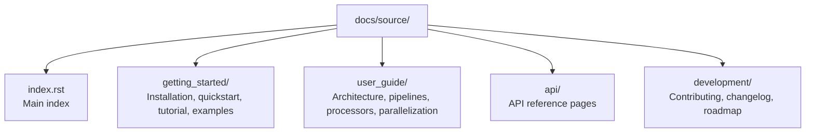

# FACETpy Documentation

This directory contains the Sphinx documentation sources for FACETpy.

## Build Documentation

Install docs dependencies:

```text
poetry install -E docs
```

Build HTML docs from repository root:

```text
poetry run sphinx-build -b html docs/source docs/build
```

Open `docs/build/index.html` in your browser:

Unix (macOS/Linux):

```bash
open docs/build/index.html
```

Windows (PowerShell):

```powershell
start docs/build/index.html
```

## Clean Build

Unix (macOS/Linux):

```bash
rm -rf docs/build
poetry run sphinx-build -b html docs/source docs/build
```

Windows (PowerShell):

```powershell
Remove-Item -Recurse -Force docs/build
poetry run sphinx-build -b html docs/source docs/build
```

## Documentation Structure



## Style Guidelines

- Use reStructuredText (`.rst`) for pages in `docs/source`.
- Keep code examples executable where practical.
- Use NumPy-style docstrings in code examples and API docs.

## Local Authoring Checklist

1. Update relevant page(s) under `docs/source`.
2. Ensure new pages are linked from `index.rst` or a section toctree.
3. Build docs locally.
4. Spot-check cross-references and code blocks.

## Troubleshooting

### Missing `myst_parser`

```text
poetry install -E docs
```

### Autodoc import errors

Run builds from the repository root so `docs/source/conf.py` path setup stays valid:

```text
poetry run sphinx-build -b html docs/source docs/build
```

### Theme issues

```text
poetry install -E docs
```

## Read the Docs

Read the Docs uses repository configuration (`.readthedocs.yaml`) and the `docs`
extra dependencies from `pyproject.toml`.
