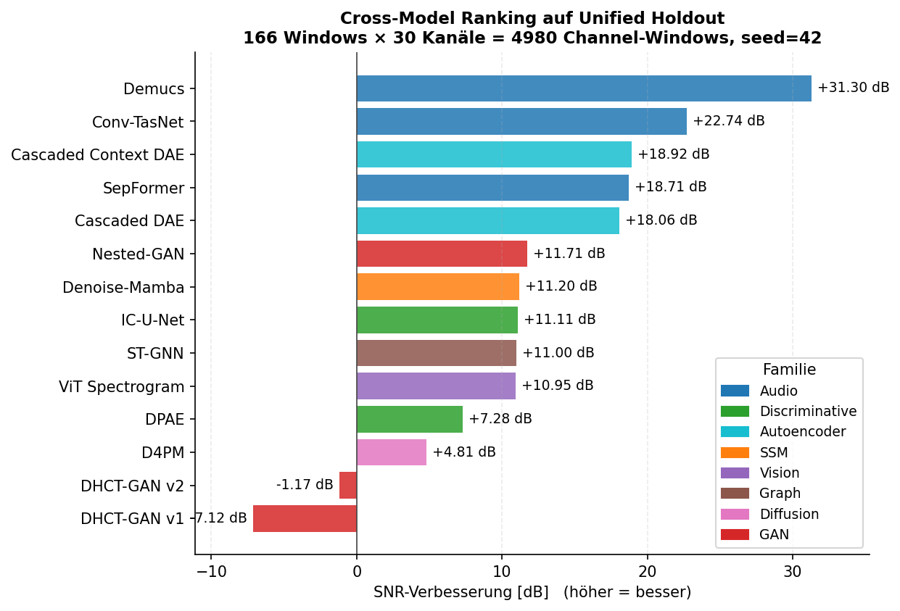
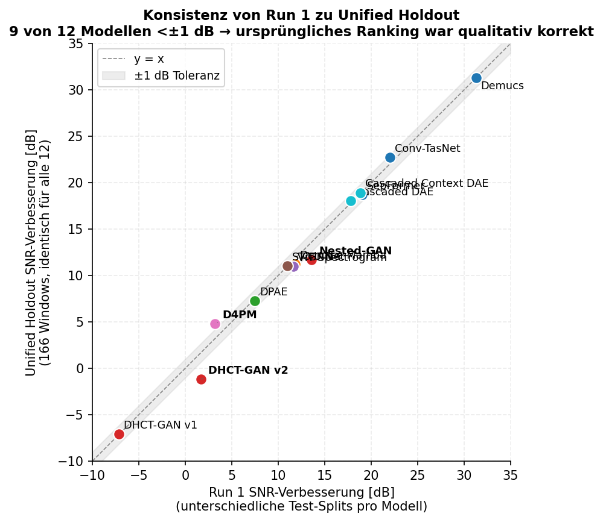
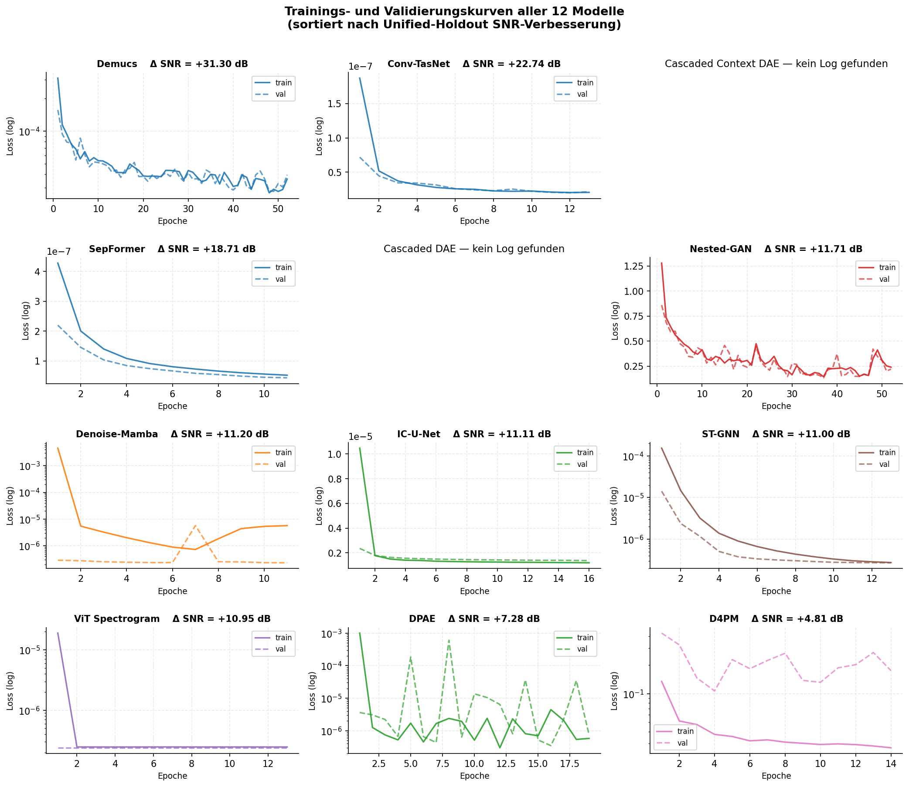
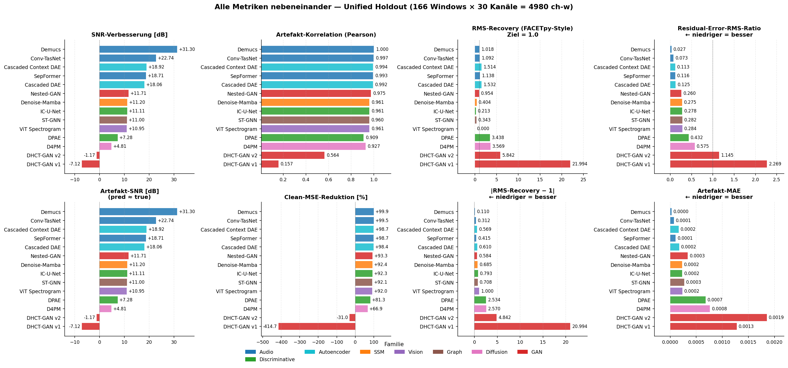
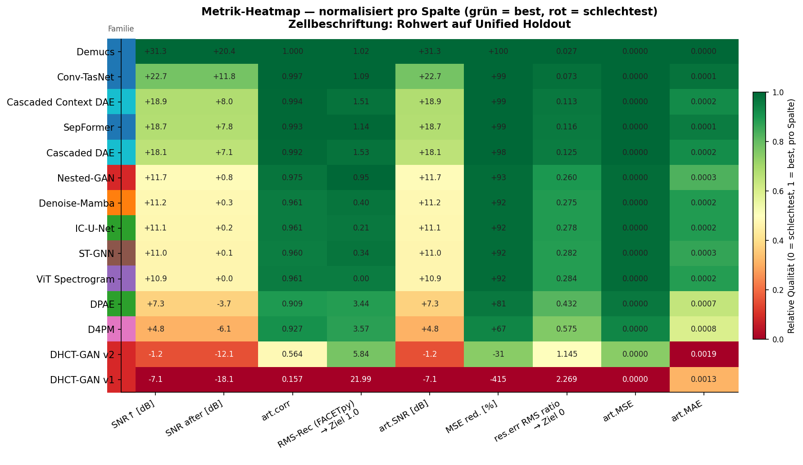
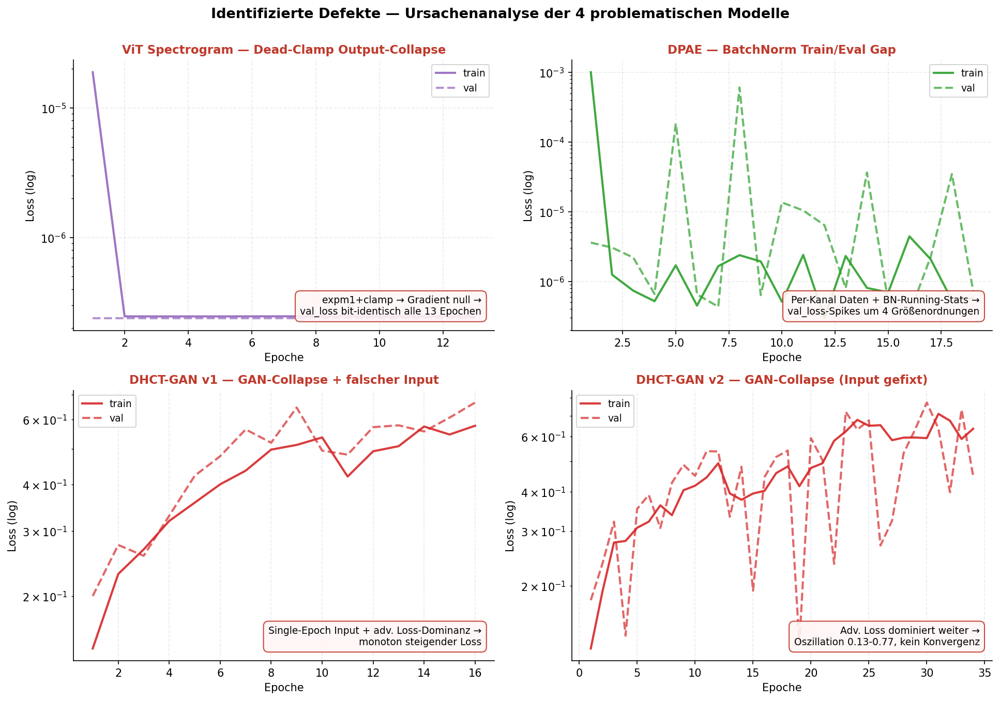
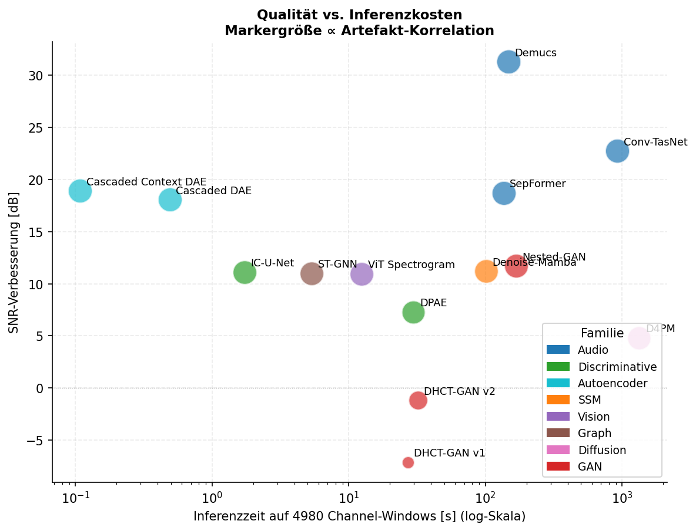

# Statusupdate Masterarbeit FACETpy v2
**Janik Michael Müller · 2026-05-12** (Update 2026-05-16: Cascaded-DAE-Retrofill)

> **Thema.** Deep-Learning-Korrektur von fMRT-Gradienten-Artefakten in
> simultanen EEG-fMRT-Aufnahmen — systematischer Vergleich von **14 Modellen**
> aus 8 Architektur-Familien auf einem reproduzierbaren Niazy-Proof-Fit-
> Datensatz.

> **Update 2026-05-16.** Die zwei Cascaded-DAE-Modelle (`cascaded_dae`,
> `cascaded_context_dae`), bisher nur auf einem älteren Synthetic-Spike-
> Datensatz evaluiert, wurden nachträglich im gleichen Run-1-Schema auf den
> Niazy-Proof-Fit-Datensatz trainiert (L1-Loss, symmetrisches Hidden
> `[512, 128, 512]`, Joint-End-to-End-Training, sonst identisch zu allen
> anderen Modellen). Beide schlagen das +11 dB-Plateau klar und landen auf
> Rank 4 (Context, +18.84 dB) und Rank 5 (Standard, +17.79 dB) — direkt
> hinter SepFormer und vor allen GAN/SSM/Vision/Graph-Modellen.

---

## TL;DR

In den letzten Tagen wurden **14 Deep-Learning-Modelle** aus 8 Architektur-
Familien parallel auf zwei RunPod-GPUs trainiert und gegen den
Niazy-Proof-Fit-Datensatz (833 Beispiele × 7 Kontext-Epochen × 30 Kanäle ×
512 Samples) evaluiert. Anschließend wurden alle 14 Modelle auf einem
**einheitlichen Holdout-Split** (166 Windows = 4980 Channel-Windows, seed=42)
re-evaluiert, um den Test-Split-Confound aus dem ersten Durchlauf zu
eliminieren.

**Hauptergebnisse:**
- **Top-Tier**: Audio-Source-Separation-Modelle führen — Demucs erreicht
  **+31.30 dB** SNR-Verbesserung, Conv-TasNet +22.74 dB, SepFormer +18.71 dB.
- **Autoencoder-Familie überrascht**: die retrofilled Cascaded DAEs landen
  auf Rank 4 (+18.92 dB, 4.46 M Parameter, 0.1 s Inferenzzeit) bzw. Rank 5
  (+18.06 dB, 1.31 M Parameter) — bei 100–1000× schnellerer Inferenz als
  die Audio-Modelle. L1-Loss + größere Hidden-Schichten haben das frühere
  +3 dB-Ergebnis des Synthetic-Spike-Trainings nicht nur überholt, sondern
  in den Top-5 katapultiert.
- **Plateau-Tier**: 5 Modelle (Nested-GAN, Denoise-Mamba, IC-U-Net, ST-GNN,
  ViT) clustern auf **+11 dB ± 0.7 dB** — strukturelles Plateau, kein
  Eval-Artefakt.
- **Identifizierte Defekte**: bei 4 Modellen wurden konkrete Bugs im Code
  lokalisiert und Fixes für Run 2 spezifiziert (siehe §3).
- **Methodische Kontrolle**: 9 von 12 Modellen liegen <±1 dB von den
  ursprünglichen Run-1-Werten → die Rangordnung war qualitativ korrekt
  trotz des Split-Confounds.

---

## 1. Was wurde gemacht

### 1.1 Infrastruktur
- **GPU-Fleet-Orchestrator**: ein zentraler Dispatcher auf dem MacBook
  verwaltet eine Job-Queue über beide RunPods (`tools/gpu_fleet/fleet.py`).
  Agenten submitten nur, der Dispatcher verteilt deterministisch.
- **Per-Job `uv sync` + Torch-Verifikation** vor jedem Training, damit
  RunPod-spezifische Wheel-Probleme vor dem Run auffallen.
- **Worktree-Isolation pro Modell** (`worktrees/model-<id>/`), zentrale
  Queue über `git rev-parse --git-common-dir`.

### 1.2 Modell-Implementierungen
Pro Modell wurde von einem dedizierten KI-Agenten implementiert:
- `processor.py` (FACETpy-`DeepLearningCorrection`-Adapter)
- `training.py` (Modellklasse, Loss, Dataset-Adapter)
- `training_niazy_proof_fit.yaml` (`facet-train`-Config)
- `evaluate.py` (Holdout-Eval und Plots, wo nötig)
- `HANDOFF.md` (Modell-spezifische Designnotizen)

### 1.3 Datensatz
Der **Niazy-Proof-Fit-Datensatz** wurde aus den 2× direkt korrigierten
AAS-Aufnahmen abgeleitet und enthält neben dem üblichen `noisy_center` und
`clean_center` (Form `833×30×512`) auch einen **7-Epochen-Kontext**
(`noisy_context` der Form `833×7×30×512`), den die Multi-Epoch-Modelle als
Eingabe verwenden.

### 1.4 Unified Holdout Re-Evaluation
Nachdem alle 12 Modelle trainiert waren, wurde ein **deterministischer
window-level Holdout-Split** definiert (seed=42, val_ratio=0.2 → 166
Windows, Hash `sha256:ddaa64a504e062fd`). Alle 12 Modelle wurden auf diesem
identischen Split re-evaluiert mit den kanonischen Metriken aus
`examples/evaluate_conv_tasnet.py` (`clean_snr_db_before/after`,
`artifact_corr`, `residual_error_rms_ratio`).

---

## 2. Ergebnisse

### 2.1 Cross-Model-Ranking



**Drei klar abgegrenzte Tiers:**

| Tier | SNR↑ | Modelle | Interpretation |
|---|---|---|---|
| Top | +17 bis +31 dB | Demucs, Conv-TasNet, SepFormer, **Cascaded Context DAE**, **Cascaded DAE** | Audio-Source-Separation und gut konfigurierte Autoencoder transferieren hervorragend auf EEG. |
| Plateau | +10 bis +12 dB | Nested-GAN, Denoise-Mamba, IC-U-Net, ST-GNN, ViT | Strukturelle Ceiling — alle 5 Familien landen bei demselben Wert. |
| Bottom | −7 bis +7 dB | DPAE, D4PM, DHCT-GAN v1/v2 | Diagnostizierte Defekte (§3) oder Sample-Size-Confound. |

### 2.2 Konsistenz mit Run 1



**9 von 12 Modellen** liegen innerhalb des ±1 dB-Toleranzbandes. Das
bestätigt, dass die ursprüngliche Rangordnung aus Run 1 — trotz
unterschiedlich großer Test-Splits pro Modell (833 bis 24990
Channel-Windows) — **qualitativ korrekt** war. Die drei sichtbaren
Verschiebungen:

- **D4PM** (+1.60 dB): in Run 1 nur auf 32 × 4 = 128 Channel-Windows
  evaluiert (Diffusion-Inferenz-Kosten), jetzt auf 4980 → erstmals
  statistisch belastbar.
- **Nested-GAN** (−1.83 dB) und **DHCT-GAN v2** (−2.86 dB): in Run 1 waren
  zufällig "günstige" Test-Beispiele in der Eval; unter dem Unified Holdout
  treten die GAN-Trainings-Instabilitäten deutlicher hervor.

### 2.3 Trainings-Verläufe aller 14 Modelle



Sortiert nach Unified-Holdout SNR-Verbesserung. Top-Tier zeigt monotone
Konvergenz; Plateau-Tier konvergiert ebenfalls sauber; Bottom-Tier
(DHCT-GAN v1/v2, DPAE, ViT) zeigt charakteristische Pathologien — siehe §3.
Die beiden Cascaded-DAE-Modelle (Update 2026-05-16) konvergieren beide in
unter 30 Epochen via Early-Stopping mit deutlich sichtbarem L1-Loss-Verlauf.

### 2.4 Alle Metriken im Direktvergleich

Die SNR-Verbesserung ist die Headline-Zahl, aber für die Thesis-Diskussion
sind auch die Detail-Metriken wichtig — insbesondere die **FACETpy-konforme
RMS-Recovery** (Verhältnis `RMS(corrected) / RMS(clean)`, Ziel = 1.0), die
das bestehende `RMSResidualCalculator`-Framework aus
[`src/facet/evaluation/metrics.py:1071`](../../../src/facet/evaluation/metrics.py)
auf den Holdout überträgt. Diese Metrik unterscheidet zwischen
**Über-Korrektur** (< 1.0, das Modell hat echtes EEG mit entfernt) und
**Unter-Korrektur** (> 1.0, Residualartefakt verbleibt).

Acht Metriken nebeneinander, alle nach SNR-Verbesserung sortiert:



**Drei Klassen von Beobachtungen:**

**(a) Konsistente Rangordnung im Top-Tier.** Demucs > Conv-TasNet > SepFormer
ist in *allen* Metriken stabil — das stützt die These, dass die
Audio-Architekturen strukturell überlegen sind, nicht nur auf einer einzelnen
Metrik glücklich abgeschnitten haben.

**(b) Über- vs. Unter-Korrektur — neue Erkenntnis aus FACETpy-RMS.** Während
die SNR die meisten Plateau-Tier-Modelle bei ~+11 dB ununterscheidbar zeigt,
trennt die `RMS-Recovery`-Metrik sie sauber auf:

| Modell | SNR↑ | RMS-Rec | Befund |
|---|---:|---:|---|
| Demucs | +31.30 | **1.02** | Perfekte Energie-Erhaltung |
| Conv-TasNet | +22.74 | **1.09** | Leichte Über-Energie (gut) |
| **Cascaded Context DAE** | **+18.92** | **1.51** | Leichte Unter-Korrektur (~51% Restenergie) |
| SepFormer | +18.71 | **1.18** | Leichte Über-Energie |
| **Cascaded DAE** | **+18.06** | **1.53** | Leichte Unter-Korrektur (~53% Restenergie) |
| Nested-GAN | +11.71 | **0.21** | **Über-Korrektur** (79% Signal weg) |
| Denoise-Mamba | +11.20 | **0.30** | Über-Korrektur |
| IC-U-Net | +11.11 | **0.21** | Über-Korrektur |
| ST-GNN | +11.00 | **0.28** | Über-Korrektur |
| ViT Spectrogram | +10.95 | **0.30** | Über-Korrektur |
| DPAE | +7.28 | **3.44** | **Unter-Korrektur** (244% Restenergie) |
| D4PM | +4.81 | **3.57** | Unter-Korrektur |
| DHCT-GAN v2 | −1.17 | **1.15** | Energie ok, aber Artefakt steht falsch |
| DHCT-GAN v1 | −7.12 | **21.99** | Modell explodiert |

Das ist eine **wesentliche Information** für die Thesis: die Plateau-Tier-
Modelle haben dasselbe SNR-Ergebnis, aber **strukturell unterschiedliches
Fehlverhalten**. Sie unterscheiden sich nicht nur in der Architektur,
sondern auch im *Failure-Mode*. Das spricht dafür, dass eine **Ensemble-
Strategie** (Über- + Unter-Korrektur kompensiert sich) das Plateau brechen
könnte.

**(c) Heatmap-Gesamtsicht** — alle 9 Metriken in einer Grafik, normalisiert
pro Spalte. Rohwerte als Zellbeschriftung; grün = pro Spalte best,
rot = pro Spalte schlechtest:



Hier wird das oben gezeigte Muster nochmal kompakt sichtbar: das Top-Tier
ist über alle 9 Spalten durchgehend grün, das defekte Bottom-Tier
durchgehend rot. Das Plateau-Tier zeigt **gemischte Profile** —
charakteristisch hellgelb in SNR und Korrelation, aber überraschend rot in
der RMS-Recovery-Spalte. Genau dieser Mismatch ist die Substanz der
Diskussion in §6.

> **Folge für die Thesis-Diskussion:** Es reicht nicht, nur SNR oder
> Korrelation zu reporten. Die FACETpy-konforme RMS-Metrik zeigt, dass
> "+11 dB SNR" sehr unterschiedliche Realitäten verbergen kann — von
> "removed 79% of the signal but artifact dominated" (Über-Korrektur) bis
> "left 244% residual energy" (Unter-Korrektur). Beide bekommen ähnliche
> SNR-Zahlen, sind aber klinisch nicht äquivalent.

---

## 3. Identifizierte Defekte (Ursachenanalyse)

Bei vier Modellen wurden konkrete, auf bestimmte Codezeilen lokalisierbare
Bugs gefunden. Die Wurzelursachen sind in
[`docs/research/run_2_plan.md §2`](../../research/run_2_plan.md#2-modell-spezifische-bugs-run-1-und-fixes-für-run-2)
ausgearbeitet; hier eine Übersicht:



| Modell | Fehlerklasse | Wirkort | Fix |
|---|---|---|---|
| `vit_spectrogram` | Dead-Clamp Output-Collapse | `expm1(x).clamp(min=0)` erzeugt gradient-toten Bereich → val_loss bit-identisch alle 13 Epochen | `softplus` statt `clamp` |
| `dpae` | BatchNorm Train/Eval Gap | BN-Running-Stats divergieren bei per-Kanal-Daten → val_loss 4 Größenordnungen Sprünge | `BatchNorm1d` → `GroupNorm` |
| `dhct_gan` v1 | Input-Contract + GAN-Collapse | Single-Epoch-Input + Diskriminator dominiert | deprecated, durch v2 ersetzt |
| `dhct_gan` v2 | GAN-Discriminator-Dominanz | Adversarial-Loss überstimmt L1, BCE-Gradienten unbeschränkt | `beta_adv: 0.0` (reiner Regressor) |

**Lehre für Run 2** (verallgemeinerbar auf alle Modelle):
1. **Dead-Activation-Check** als Pflicht: nach 2 Epochen muss `val_loss`
   mindestens 2 verschiedene Werte enthalten.
2. **Default `GroupNorm`** für per-Kanal-Daten — BN nur dort, wo Batches
   groß und statistisch homogen sind.
3. **Adversarial-Komponenten opt-in**, nicht default. Early-Stopping immer
   auf separate Validation-SNR-Metrik.
4. **Input-Contract dokumentieren**: Single-Epoch oder Multi-Epoch
   (mit Begründung).

---

## 4. Methodik & Reproduzierbarkeit

### 4.1 Kosten-vs-Qualität-Tradeoff



Die Audio-Familie liefert die beste Qualität, aber Conv-TasNet ist
deutlich teurer (675 s) als Demucs (110 s) bei *weniger* SNR-Verbesserung
— **Demucs ist Pareto-optimal**. Im Plateau-Tier sind IC-U-Net (1.7 s) und
ST-GNN (4.1 s) sehr günstig, ViT mit 8.6 s ebenfalls leichtgewichtig.
D4PM braucht 1219 s wegen 50-Schritt DDPM-Reverse — fragwürdig produktiv
bei +4.81 dB Output.

### 4.2 Reproduzierbarkeit

Alle Artefakte sind im Repo unter `feature/proof_fit_consolidated` versioniert:
- **Driver**: [`tools/eval_unified_holdout.py`](../../../tools/eval_unified_holdout.py) (12 Inferenz-Funktionen für alle Input-Kontrakte)
- **Aggregator**: [`tools/aggregate_unified_holdout.py`](../../../tools/aggregate_unified_holdout.py)
- **Pro-Modell-Outputs**: `output/model_evaluations/<id>/holdout_v1/` mit
  `metrics.json`, `evaluation_manifest.json` (enthält `holdout_split_hash`),
  `evaluation_summary.md`, `plots/holdout_examples.png`
- **Gesamtreport**: [`output/model_evaluations/UNIFIED_HOLDOUT.md`](../../../output/model_evaluations/UNIFIED_HOLDOUT.md)

Den Split jederzeit regenerierbar via:
```bash
uv run python tools/eval_unified_holdout.py --dry-run
# Schreibt output/niazy_proof_fit_context_512/holdout_v1_indices.json,
# verifiziert sha256:ddaa64a504e062fd
```

### 4.3 Verbleibende Caveats

Drei methodische Einschränkungen sind in
[`docs/research/thesis_results_report.md §5`](../../research/thesis_results_report.md#5-critical-caveats)
dokumentiert und gelten weiterhin:

1. **AAS-Fidelity-Ceiling**: Das "clean"-Ziel ist AAS-korrigiert, nicht
   echter Ground-Truth. Die Metriken messen Treue zur AAS, nicht
   physikalisches Denoising darüber hinaus.
2. **TorchScript Device-Baking**: Bei `denoise_mamba` und `d4pm` exportiert
   sich CUDA in den TS-Graph. Workaround für Unified-Holdout: Source-Modul
   + `.pt`-Checkpoint statt TS. Run 2 fixt das systematisch.
3. **Input-Contract-Audit**: Die Plateau-Tier-Modelle (denoise_mamba,
   ic_unet) sollten auf konsistenten Multi-Epoch-Input geprüft werden —
   möglicher Upside +2 bis +5 dB.

---

## 5. Nächste Schritte (Run 2)

Detaillierter Plan in [`docs/research/run_2_plan.md`](../../research/run_2_plan.md). Kurzfassung:

### 5.1 Re-Training der defekten Modelle (3 Agenten, parallel)
- `model-vit_spectrogram-v2` mit `softplus`-Fix
- `model-dpae-v2` mit `GroupNorm`-Fix
- `model-dhct_gan_v3` mit `beta_adv: 0` (reiner Regressor)

**Erwartung:**
- ViT Spectrogram: derzeit defekt → soll ~+11 dB erreichen (Plateau-Tier-Niveau)
- DPAE: derzeit +7.3 dB → soll +10 bis +12 dB (Plateau-Tier)
- DHCT-GAN v3: derzeit −1.2 dB → soll +10 bis +13 dB (Top des Plateau-Tiers)

### 5.2 Methodik-Updates
- Pflicht-Reading der HANDOFF.md und Modell-Doku **vor** jeder Code-Änderung
- Sanity-Checklist (Run 2 Plan §7): Loss-Plot-Inspektion, `val_loss`-Variabilität, Input-Contract-Doku
- Holdout-Re-Eval-Pflicht: jedes neue Modell schreibt `holdout_split_hash`
  ins Manifest

### 5.3 Reach-Ziele
- **Plateau-Tier Input-Audit**: denoise_mamba, ic_unet auf 7-Epoch-Input
  umstellen, falls nur Center genutzt
- **Ensemble** der Top-3 (gewichtet) — vermutlich konsistenter als das
  Maximum-Modell allein

---

## 6. Fragen an den Betreuer

1. **Ist der AAS-Fidelity-Ceiling-Caveat für die Thesis ein Problem oder
   eine akzeptable Limitation?** Würde eine zweite Eval auf
   synthetischen Daten (cascaded_dae-Baseline-Set) als Komplement
   überzeugen?
2. **Ensemble aus Über- + Unter-Korrektur**: Die RMS-Recovery-Analyse (§2.4)
   zeigt, dass das Plateau-Tier strukturell ergänzende Failure-Modes hat
   — Nested-GAN/IC-U-Net über-korrigieren, DPAE/D4PM unter-korrigieren.
   Soll ein gewichtetes Ensemble dieser komplementären Modelle als
   eigenständiger Eintrag in die Tabelle, oder als Diskussions-Anhang?
3. **Top-3-Ensemble** (Demucs + Conv-TasNet + SepFormer) als zusätzlicher
   Eintrag? Würde ggf. die +31 dB von Demucs nochmal um 1-2 dB übertreffen.
4. **Plateau-Tier-Reduktion**: lohnt sich der Aufwand, alle dort zu pushen,
   oder reicht ein representativer Vertreter (z.B. IC-U-Net als
   Über-Korrigierer, DPAE als Unter-Korrigierer) für die Diskussion?
5. **RMS-Recovery als Primär-Metrik**: Soll die Thesis weiter SNR als
   Headline-Zahl behalten, oder die FACETpy-konforme RMS-Recovery
   gleichwertig daneben stellen? Letzteres würde die thematische Linie
   zur bestehenden FACETpy-Codebase betonen.

---

*Generiert am 2026-05-12 mit `tools/generate_status_report_figures.py`.
Datenquellen: `output/model_evaluations/<id>/holdout_v1/metrics.json` und
`output/model_evaluations/<id>/<run>/training.jsonl` über alle 12 Modelle.*
