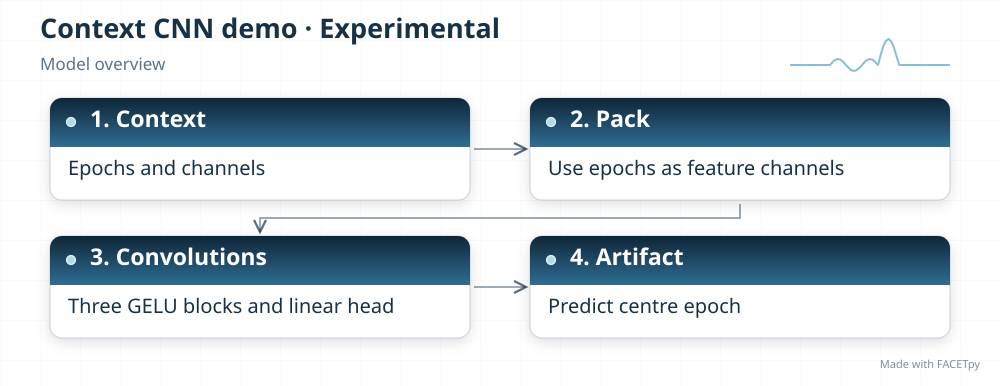
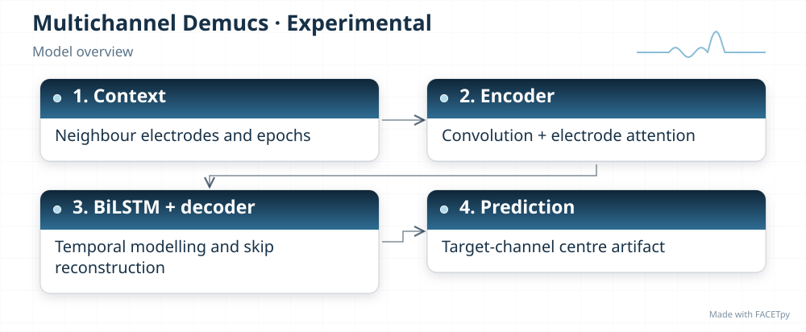
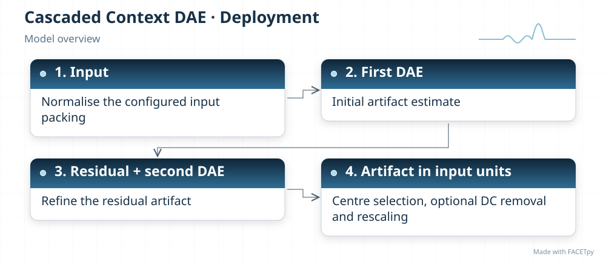
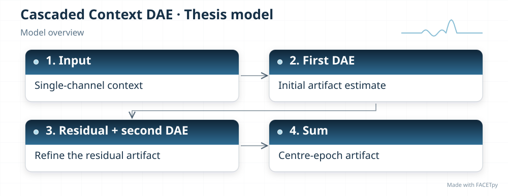

.. Generated by tools/diagrams/build_model_diagrams.py; edit the model profiles.

Model diagrams
==============

Every model has a compact overview and a detailed architecture diagram.
Overviews print at 190 mm wide and at most 128 mm high, within half an A4 page.
Detailed diagrams show explicit data paths, skip connections and parallel branches.
Repeated blocks and dimensions can be configurable: consult the implementation
and the selected run configuration for exact values.

SVGs use a transparent background. Download the architecture profile to inspect
the source references and regenerate the diagrams with the repository's
``facetpy-diagram`` skill and ``tools/diagrams/build_model_diagrams.py``.

.. _diagram-experimental-examples-demo01:

Context CNN demo
----------------

Variant: ``experimental/examples/demo01``.

   Context CNN demo: high-level processing steps.

:download:`Detailed architecture (SVG) <../../src/facet/models/experimental/examples/demo01/diagrams/architecture.svg>`
|
:download:`Architecture profile (JSON) <../../src/facet/models/experimental/examples/demo01/diagrams/architecture.json>`

.. _diagram-experimental-paper-accurate-conv-tasnet:

Conv-TasNet
-----------

Variant: ``experimental/paper_accurate/conv_tasnet``.

.. figure:: ../../src/facet/models/experimental/paper_accurate/conv_tasnet/diagrams/overview.svg
   :width: 190mm
   :alt: Conv-TasNet — compact model overview

   Conv-TasNet: high-level processing steps.

:download:`Detailed architecture (SVG) <../../src/facet/models/experimental/paper_accurate/conv_tasnet/diagrams/architecture.svg>`
|
:download:`Architecture profile (JSON) <../../src/facet/models/experimental/paper_accurate/conv_tasnet/diagrams/architecture.json>`

.. _diagram-experimental-paper-accurate-d4pm:

D4PM
----

Variant: ``experimental/paper_accurate/d4pm``.

.. figure:: ../../src/facet/models/experimental/paper_accurate/d4pm/diagrams/overview.svg
   :width: 190mm
   :alt: D4PM — compact model overview

   D4PM: high-level processing steps.

:download:`Detailed architecture (SVG) <../../src/facet/models/experimental/paper_accurate/d4pm/diagrams/architecture.svg>`
|
:download:`Architecture profile (JSON) <../../src/facet/models/experimental/paper_accurate/d4pm/diagrams/architecture.json>`

.. _diagram-experimental-paper-accurate-demucs:

Demucs
------

Variant: ``experimental/paper_accurate/demucs``.

.. figure:: ../../src/facet/models/experimental/paper_accurate/demucs/diagrams/overview.svg
   :width: 190mm
   :alt: Demucs — compact model overview

   Demucs: high-level processing steps.

:download:`Detailed architecture (SVG) <../../src/facet/models/experimental/paper_accurate/demucs/diagrams/architecture.svg>`
|
:download:`Architecture profile (JSON) <../../src/facet/models/experimental/paper_accurate/demucs/diagrams/architecture.json>`

.. _diagram-experimental-paper-accurate-denoise-mamba:

DenoiseMamba
------------

Variant: ``experimental/paper_accurate/denoise_mamba``.

.. figure:: ../../src/facet/models/experimental/paper_accurate/denoise_mamba/diagrams/overview.svg
   :width: 190mm
   :alt: DenoiseMamba — compact model overview

   DenoiseMamba: high-level processing steps.

:download:`Detailed architecture (SVG) <../../src/facet/models/experimental/paper_accurate/denoise_mamba/diagrams/architecture.svg>`
|
:download:`Architecture profile (JSON) <../../src/facet/models/experimental/paper_accurate/denoise_mamba/diagrams/architecture.json>`

.. _diagram-experimental-paper-accurate-dhct-gan:

DHCT-GAN
--------

Variant: ``experimental/paper_accurate/dhct_gan``.

.. figure:: ../../src/facet/models/experimental/paper_accurate/dhct_gan/diagrams/overview.svg
   :width: 190mm
   :alt: DHCT-GAN — compact model overview

   DHCT-GAN: high-level processing steps.

:download:`Detailed architecture (SVG) <../../src/facet/models/experimental/paper_accurate/dhct_gan/diagrams/architecture.svg>`
|
:download:`Architecture profile (JSON) <../../src/facet/models/experimental/paper_accurate/dhct_gan/diagrams/architecture.json>`

.. _diagram-experimental-paper-accurate-dhct-gan-v2:

DHCT-GAN v2
-----------

Variant: ``experimental/paper_accurate/dhct_gan_v2``.

.. figure:: ../../src/facet/models/experimental/paper_accurate/dhct_gan_v2/diagrams/overview.svg
   :width: 190mm
   :alt: DHCT-GAN v2 — compact model overview

   DHCT-GAN v2: high-level processing steps.

:download:`Detailed architecture (SVG) <../../src/facet/models/experimental/paper_accurate/dhct_gan_v2/diagrams/architecture.svg>`
|
:download:`Architecture profile (JSON) <../../src/facet/models/experimental/paper_accurate/dhct_gan_v2/diagrams/architecture.json>`

.. _diagram-experimental-paper-accurate-dpae:

DPAE
----

Variant: ``experimental/paper_accurate/dpae``.

.. figure:: ../../src/facet/models/experimental/paper_accurate/dpae/diagrams/overview.svg
   :width: 190mm
   :alt: DPAE — compact model overview

   DPAE: high-level processing steps.

:download:`Detailed architecture (SVG) <../../src/facet/models/experimental/paper_accurate/dpae/diagrams/architecture.svg>`
|
:download:`Architecture profile (JSON) <../../src/facet/models/experimental/paper_accurate/dpae/diagrams/architecture.json>`

.. _diagram-experimental-paper-accurate-ic-unet:

IC-U-Net
--------

Variant: ``experimental/paper_accurate/ic_unet``.

.. figure:: ../../src/facet/models/experimental/paper_accurate/ic_unet/diagrams/overview.svg
   :width: 190mm
   :alt: IC-U-Net — compact model overview

   IC-U-Net: high-level processing steps.

:download:`Detailed architecture (SVG) <../../src/facet/models/experimental/paper_accurate/ic_unet/diagrams/architecture.svg>`
|
:download:`Architecture profile (JSON) <../../src/facet/models/experimental/paper_accurate/ic_unet/diagrams/architecture.json>`

.. _diagram-experimental-paper-accurate-nested-gan:

Nested-GAN
----------

Variant: ``experimental/paper_accurate/nested_gan``.

.. figure:: ../../src/facet/models/experimental/paper_accurate/nested_gan/diagrams/overview.svg
   :width: 190mm
   :alt: Nested-GAN — compact model overview

   Nested-GAN: high-level processing steps.

:download:`Detailed architecture (SVG) <../../src/facet/models/experimental/paper_accurate/nested_gan/diagrams/architecture.svg>`
|
:download:`Architecture profile (JSON) <../../src/facet/models/experimental/paper_accurate/nested_gan/diagrams/architecture.json>`

.. _diagram-experimental-paper-accurate-sepformer:

SepFormer
---------

Variant: ``experimental/paper_accurate/sepformer``.

.. figure:: ../../src/facet/models/experimental/paper_accurate/sepformer/diagrams/overview.svg
   :width: 190mm
   :alt: SepFormer — compact model overview

   SepFormer: high-level processing steps.

:download:`Detailed architecture (SVG) <../../src/facet/models/experimental/paper_accurate/sepformer/diagrams/architecture.svg>`
|
:download:`Architecture profile (JSON) <../../src/facet/models/experimental/paper_accurate/sepformer/diagrams/architecture.json>`

.. _diagram-experimental-paper-accurate-st-gnn:

ST-GNN
------

Variant: ``experimental/paper_accurate/st_gnn``.

.. figure:: ../../src/facet/models/experimental/paper_accurate/st_gnn/diagrams/overview.svg
   :width: 190mm
   :alt: ST-GNN — compact model overview

   ST-GNN: high-level processing steps.

:download:`Detailed architecture (SVG) <../../src/facet/models/experimental/paper_accurate/st_gnn/diagrams/architecture.svg>`
|
:download:`Architecture profile (JSON) <../../src/facet/models/experimental/paper_accurate/st_gnn/diagrams/architecture.json>`

.. _diagram-experimental-paper-accurate-vit-spectrogram:

ViT Spectrogram
---------------

Variant: ``experimental/paper_accurate/vit_spectrogram``.

.. figure:: ../../src/facet/models/experimental/paper_accurate/vit_spectrogram/diagrams/overview.svg
   :width: 190mm
   :alt: ViT Spectrogram — compact model overview

   ViT Spectrogram: high-level processing steps.

:download:`Detailed architecture (SVG) <../../src/facet/models/experimental/paper_accurate/vit_spectrogram/diagrams/architecture.svg>`
|
:download:`Architecture profile (JSON) <../../src/facet/models/experimental/paper_accurate/vit_spectrogram/diagrams/architecture.json>`

.. _diagram-experimental-v2-demucs-mc:

Multichannel Demucs
-------------------

Variant: ``experimental/v2/demucs_mc``.

   Multichannel Demucs: high-level processing steps.

:download:`Detailed architecture (SVG) <../../src/facet/models/experimental/v2/demucs_mc/diagrams/architecture.svg>`
|
:download:`Architecture profile (JSON) <../../src/facet/models/experimental/v2/demucs_mc/diagrams/architecture.json>`

.. _diagram-masterthesis-cascaded-context-dae-deployment:

Cascaded Context DAE
--------------------

Variant: ``masterthesis/cascaded_context_dae/deployment``.

   Cascaded Context DAE: high-level processing steps.

:download:`Detailed architecture (SVG) <../../src/facet/models/masterthesis/cascaded_context_dae/deployment/diagrams/architecture.svg>`
|
:download:`Architecture profile (JSON) <../../src/facet/models/masterthesis/cascaded_context_dae/deployment/diagrams/architecture.json>`

.. _diagram-masterthesis-cascaded-context-dae:

Cascaded Context DAE
--------------------

Variant: ``masterthesis/cascaded_context_dae``.

   Cascaded Context DAE: high-level processing steps.

:download:`Detailed architecture (SVG) <../../src/facet/models/masterthesis/cascaded_context_dae/diagrams/architecture.svg>`
|
:download:`Architecture profile (JSON) <../../src/facet/models/masterthesis/cascaded_context_dae/diagrams/architecture.json>`

.. _diagram-masterthesis-cascaded-dae-deployment:

Cascaded DAE
------------

Variant: ``masterthesis/cascaded_dae/deployment``.

.. figure:: ../../src/facet/models/masterthesis/cascaded_dae/deployment/diagrams/overview.svg
   :width: 190mm
   :alt: Cascaded DAE — compact model overview

   Cascaded DAE: high-level processing steps.

:download:`Detailed architecture (SVG) <../../src/facet/models/masterthesis/cascaded_dae/deployment/diagrams/architecture.svg>`
|
:download:`Architecture profile (JSON) <../../src/facet/models/masterthesis/cascaded_dae/deployment/diagrams/architecture.json>`

.. _diagram-masterthesis-cascaded-dae:

Cascaded DAE
------------

Variant: ``masterthesis/cascaded_dae``.

.. figure:: ../../src/facet/models/masterthesis/cascaded_dae/diagrams/overview.svg
   :width: 190mm
   :alt: Cascaded DAE — compact model overview

   Cascaded DAE: high-level processing steps.

:download:`Detailed architecture (SVG) <../../src/facet/models/masterthesis/cascaded_dae/diagrams/architecture.svg>`
|
:download:`Architecture profile (JSON) <../../src/facet/models/masterthesis/cascaded_dae/diagrams/architecture.json>`

.. _diagram-masterthesis-conv-tasnet-deployment:

Conv-TasNet
-----------

Variant: ``masterthesis/conv_tasnet/deployment``.

.. figure:: ../../src/facet/models/masterthesis/conv_tasnet/deployment/diagrams/overview.svg
   :width: 190mm
   :alt: Conv-TasNet — compact model overview

   Conv-TasNet: high-level processing steps.

:download:`Detailed architecture (SVG) <../../src/facet/models/masterthesis/conv_tasnet/deployment/diagrams/architecture.svg>`
|
:download:`Architecture profile (JSON) <../../src/facet/models/masterthesis/conv_tasnet/deployment/diagrams/architecture.json>`

.. _diagram-masterthesis-conv-tasnet:

Conv-TasNet
-----------

Variant: ``masterthesis/conv_tasnet``.

.. figure:: ../../src/facet/models/masterthesis/conv_tasnet/diagrams/overview.svg
   :width: 190mm
   :alt: Conv-TasNet — compact model overview

   Conv-TasNet: high-level processing steps.

:download:`Detailed architecture (SVG) <../../src/facet/models/masterthesis/conv_tasnet/diagrams/architecture.svg>`
|
:download:`Architecture profile (JSON) <../../src/facet/models/masterthesis/conv_tasnet/diagrams/architecture.json>`

.. _diagram-masterthesis-d4pm-deployment:

D4PM
----

Variant: ``masterthesis/d4pm/deployment``.

.. figure:: ../../src/facet/models/masterthesis/d4pm/deployment/diagrams/overview.svg
   :width: 190mm
   :alt: D4PM — compact model overview

   D4PM: high-level processing steps.

:download:`Detailed architecture (SVG) <../../src/facet/models/masterthesis/d4pm/deployment/diagrams/architecture.svg>`
|
:download:`Architecture profile (JSON) <../../src/facet/models/masterthesis/d4pm/deployment/diagrams/architecture.json>`

.. _diagram-masterthesis-d4pm:

D4PM
----

Variant: ``masterthesis/d4pm``.

.. figure:: ../../src/facet/models/masterthesis/d4pm/diagrams/overview.svg
   :width: 190mm
   :alt: D4PM — compact model overview

   D4PM: high-level processing steps.

:download:`Detailed architecture (SVG) <../../src/facet/models/masterthesis/d4pm/diagrams/architecture.svg>`
|
:download:`Architecture profile (JSON) <../../src/facet/models/masterthesis/d4pm/diagrams/architecture.json>`

.. _diagram-masterthesis-demucs-deployment:

Demucs
------

Variant: ``masterthesis/demucs/deployment``.

.. figure:: ../../src/facet/models/masterthesis/demucs/deployment/diagrams/overview.svg
   :width: 190mm
   :alt: Demucs — compact model overview

   Demucs: high-level processing steps.

:download:`Detailed architecture (SVG) <../../src/facet/models/masterthesis/demucs/deployment/diagrams/architecture.svg>`
|
:download:`Architecture profile (JSON) <../../src/facet/models/masterthesis/demucs/deployment/diagrams/architecture.json>`

.. _diagram-masterthesis-demucs:

Demucs
------

Variant: ``masterthesis/demucs``.

.. figure:: ../../src/facet/models/masterthesis/demucs/diagrams/overview.svg
   :width: 190mm
   :alt: Demucs — compact model overview

   Demucs: high-level processing steps.

:download:`Detailed architecture (SVG) <../../src/facet/models/masterthesis/demucs/diagrams/architecture.svg>`
|
:download:`Architecture profile (JSON) <../../src/facet/models/masterthesis/demucs/diagrams/architecture.json>`

.. _diagram-masterthesis-denoise-mamba-deployment:

DenoiseMamba
------------

Variant: ``masterthesis/denoise_mamba/deployment``.

.. figure:: ../../src/facet/models/masterthesis/denoise_mamba/deployment/diagrams/overview.svg
   :width: 190mm
   :alt: DenoiseMamba — compact model overview

   DenoiseMamba: high-level processing steps.

:download:`Detailed architecture (SVG) <../../src/facet/models/masterthesis/denoise_mamba/deployment/diagrams/architecture.svg>`
|
:download:`Architecture profile (JSON) <../../src/facet/models/masterthesis/denoise_mamba/deployment/diagrams/architecture.json>`

.. _diagram-masterthesis-denoise-mamba:

DenoiseMamba
------------

Variant: ``masterthesis/denoise_mamba``.

.. figure:: ../../src/facet/models/masterthesis/denoise_mamba/diagrams/overview.svg
   :width: 190mm
   :alt: DenoiseMamba — compact model overview

   DenoiseMamba: high-level processing steps.

:download:`Detailed architecture (SVG) <../../src/facet/models/masterthesis/denoise_mamba/diagrams/architecture.svg>`
|
:download:`Architecture profile (JSON) <../../src/facet/models/masterthesis/denoise_mamba/diagrams/architecture.json>`

.. _diagram-masterthesis-dhct-gan-deployment:

DHCT-GAN
--------

Variant: ``masterthesis/dhct_gan/deployment``.

.. figure:: ../../src/facet/models/masterthesis/dhct_gan/deployment/diagrams/overview.svg
   :width: 190mm
   :alt: DHCT-GAN — compact model overview

   DHCT-GAN: high-level processing steps.

:download:`Detailed architecture (SVG) <../../src/facet/models/masterthesis/dhct_gan/deployment/diagrams/architecture.svg>`
|
:download:`Architecture profile (JSON) <../../src/facet/models/masterthesis/dhct_gan/deployment/diagrams/architecture.json>`

.. _diagram-masterthesis-dhct-gan:

DHCT-GAN
--------

Variant: ``masterthesis/dhct_gan``.

.. figure:: ../../src/facet/models/masterthesis/dhct_gan/diagrams/overview.svg
   :width: 190mm
   :alt: DHCT-GAN — compact model overview

   DHCT-GAN: high-level processing steps.

:download:`Detailed architecture (SVG) <../../src/facet/models/masterthesis/dhct_gan/diagrams/architecture.svg>`
|
:download:`Architecture profile (JSON) <../../src/facet/models/masterthesis/dhct_gan/diagrams/architecture.json>`

.. _diagram-masterthesis-dhct-gan-strict:

DHCT-GAN strict
---------------

Variant: ``masterthesis/dhct_gan/strict``.

.. figure:: ../../src/facet/models/masterthesis/dhct_gan/strict/diagrams/overview.svg
   :width: 190mm
   :alt: DHCT-GAN strict — compact model overview

   DHCT-GAN strict: high-level processing steps.

:download:`Detailed architecture (SVG) <../../src/facet/models/masterthesis/dhct_gan/strict/diagrams/architecture.svg>`
|
:download:`Architecture profile (JSON) <../../src/facet/models/masterthesis/dhct_gan/strict/diagrams/architecture.json>`

.. _diagram-masterthesis-dhct-gan-v2-deployment:

DHCT-GAN v2
-----------

Variant: ``masterthesis/dhct_gan/v2/deployment``.

.. figure:: ../../src/facet/models/masterthesis/dhct_gan/v2/deployment/diagrams/overview.svg
   :width: 190mm
   :alt: DHCT-GAN v2 — compact model overview

   DHCT-GAN v2: high-level processing steps.

:download:`Detailed architecture (SVG) <../../src/facet/models/masterthesis/dhct_gan/v2/deployment/diagrams/architecture.svg>`
|
:download:`Architecture profile (JSON) <../../src/facet/models/masterthesis/dhct_gan/v2/deployment/diagrams/architecture.json>`

.. _diagram-masterthesis-dhct-gan-v2:

DHCT-GAN v2
-----------

Variant: ``masterthesis/dhct_gan/v2``.

.. figure:: ../../src/facet/models/masterthesis/dhct_gan/v2/diagrams/overview.svg
   :width: 190mm
   :alt: DHCT-GAN v2 — compact model overview

   DHCT-GAN v2: high-level processing steps.

:download:`Detailed architecture (SVG) <../../src/facet/models/masterthesis/dhct_gan/v2/diagrams/architecture.svg>`
|
:download:`Architecture profile (JSON) <../../src/facet/models/masterthesis/dhct_gan/v2/diagrams/architecture.json>`

.. _diagram-masterthesis-dpae-deployment:

DPAE
----

Variant: ``masterthesis/dpae/deployment``.

.. figure:: ../../src/facet/models/masterthesis/dpae/deployment/diagrams/overview.svg
   :width: 190mm
   :alt: DPAE — compact model overview

   DPAE: high-level processing steps.

:download:`Detailed architecture (SVG) <../../src/facet/models/masterthesis/dpae/deployment/diagrams/architecture.svg>`
|
:download:`Architecture profile (JSON) <../../src/facet/models/masterthesis/dpae/deployment/diagrams/architecture.json>`

.. _diagram-masterthesis-dpae:

DPAE
----

Variant: ``masterthesis/dpae``.

.. figure:: ../../src/facet/models/masterthesis/dpae/diagrams/overview.svg
   :width: 190mm
   :alt: DPAE — compact model overview

   DPAE: high-level processing steps.

:download:`Detailed architecture (SVG) <../../src/facet/models/masterthesis/dpae/diagrams/architecture.svg>`
|
:download:`Architecture profile (JSON) <../../src/facet/models/masterthesis/dpae/diagrams/architecture.json>`

.. _diagram-masterthesis-ic-unet-deployment:

IC-U-Net
--------

Variant: ``masterthesis/ic_unet/deployment``.

.. figure:: ../../src/facet/models/masterthesis/ic_unet/deployment/diagrams/overview.svg
   :width: 190mm
   :alt: IC-U-Net — compact model overview

   IC-U-Net: high-level processing steps.

:download:`Detailed architecture (SVG) <../../src/facet/models/masterthesis/ic_unet/deployment/diagrams/architecture.svg>`
|
:download:`Architecture profile (JSON) <../../src/facet/models/masterthesis/ic_unet/deployment/diagrams/architecture.json>`

.. _diagram-masterthesis-ic-unet:

IC-U-Net
--------

Variant: ``masterthesis/ic_unet``.

.. figure:: ../../src/facet/models/masterthesis/ic_unet/diagrams/overview.svg
   :width: 190mm
   :alt: IC-U-Net — compact model overview

   IC-U-Net: high-level processing steps.

:download:`Detailed architecture (SVG) <../../src/facet/models/masterthesis/ic_unet/diagrams/architecture.svg>`
|
:download:`Architecture profile (JSON) <../../src/facet/models/masterthesis/ic_unet/diagrams/architecture.json>`

.. _diagram-masterthesis-legacy-cascaded-dae:

Legacy Cascaded DAE
-------------------

Variant: ``masterthesis/legacy_cascaded_dae``.

.. figure:: ../../src/facet/models/masterthesis/legacy_cascaded_dae/diagrams/overview.svg
   :width: 190mm
   :alt: Legacy Cascaded DAE — compact model overview

   Legacy Cascaded DAE: high-level processing steps.

:download:`Detailed architecture (SVG) <../../src/facet/models/masterthesis/legacy_cascaded_dae/diagrams/architecture.svg>`
|
:download:`Architecture profile (JSON) <../../src/facet/models/masterthesis/legacy_cascaded_dae/diagrams/architecture.json>`

.. _diagram-masterthesis-nested-gan-deployment:

Nested-GAN
----------

Variant: ``masterthesis/nested_gan/deployment``.

.. figure:: ../../src/facet/models/masterthesis/nested_gan/deployment/diagrams/overview.svg
   :width: 190mm
   :alt: Nested-GAN — compact model overview

   Nested-GAN: high-level processing steps.

:download:`Detailed architecture (SVG) <../../src/facet/models/masterthesis/nested_gan/deployment/diagrams/architecture.svg>`
|
:download:`Architecture profile (JSON) <../../src/facet/models/masterthesis/nested_gan/deployment/diagrams/architecture.json>`

.. _diagram-masterthesis-nested-gan:

Nested-GAN
----------

Variant: ``masterthesis/nested_gan``.

.. figure:: ../../src/facet/models/masterthesis/nested_gan/diagrams/overview.svg
   :width: 190mm
   :alt: Nested-GAN — compact model overview

   Nested-GAN: high-level processing steps.

:download:`Detailed architecture (SVG) <../../src/facet/models/masterthesis/nested_gan/diagrams/architecture.svg>`
|
:download:`Architecture profile (JSON) <../../src/facet/models/masterthesis/nested_gan/diagrams/architecture.json>`

.. _diagram-masterthesis-sepformer-deployment:

SepFormer
---------

Variant: ``masterthesis/sepformer/deployment``.

.. figure:: ../../src/facet/models/masterthesis/sepformer/deployment/diagrams/overview.svg
   :width: 190mm
   :alt: SepFormer — compact model overview

   SepFormer: high-level processing steps.

:download:`Detailed architecture (SVG) <../../src/facet/models/masterthesis/sepformer/deployment/diagrams/architecture.svg>`
|
:download:`Architecture profile (JSON) <../../src/facet/models/masterthesis/sepformer/deployment/diagrams/architecture.json>`

.. _diagram-masterthesis-sepformer:

SepFormer
---------

Variant: ``masterthesis/sepformer``.

.. figure:: ../../src/facet/models/masterthesis/sepformer/diagrams/overview.svg
   :width: 190mm
   :alt: SepFormer — compact model overview

   SepFormer: high-level processing steps.

:download:`Detailed architecture (SVG) <../../src/facet/models/masterthesis/sepformer/diagrams/architecture.svg>`
|
:download:`Architecture profile (JSON) <../../src/facet/models/masterthesis/sepformer/diagrams/architecture.json>`

.. _diagram-masterthesis-st-gnn-deployment:

ST-GNN
------

Variant: ``masterthesis/st_gnn/deployment``.

.. figure:: ../../src/facet/models/masterthesis/st_gnn/deployment/diagrams/overview.svg
   :width: 190mm
   :alt: ST-GNN — compact model overview

   ST-GNN: high-level processing steps.

:download:`Detailed architecture (SVG) <../../src/facet/models/masterthesis/st_gnn/deployment/diagrams/architecture.svg>`
|
:download:`Architecture profile (JSON) <../../src/facet/models/masterthesis/st_gnn/deployment/diagrams/architecture.json>`

.. _diagram-masterthesis-st-gnn:

ST-GNN
------

Variant: ``masterthesis/st_gnn``.

.. figure:: ../../src/facet/models/masterthesis/st_gnn/diagrams/overview.svg
   :width: 190mm
   :alt: ST-GNN — compact model overview

   ST-GNN: high-level processing steps.

:download:`Detailed architecture (SVG) <../../src/facet/models/masterthesis/st_gnn/diagrams/architecture.svg>`
|
:download:`Architecture profile (JSON) <../../src/facet/models/masterthesis/st_gnn/diagrams/architecture.json>`

.. _diagram-masterthesis-vit-spectrogram-deployment:

ViT Spectrogram
---------------

Variant: ``masterthesis/vit_spectrogram/deployment``.

.. figure:: ../../src/facet/models/masterthesis/vit_spectrogram/deployment/diagrams/overview.svg
   :width: 190mm
   :alt: ViT Spectrogram — compact model overview

   ViT Spectrogram: high-level processing steps.

:download:`Detailed architecture (SVG) <../../src/facet/models/masterthesis/vit_spectrogram/deployment/diagrams/architecture.svg>`
|
:download:`Architecture profile (JSON) <../../src/facet/models/masterthesis/vit_spectrogram/deployment/diagrams/architecture.json>`

.. _diagram-masterthesis-vit-spectrogram:

ViT Spectrogram
---------------

Variant: ``masterthesis/vit_spectrogram``.

.. figure:: ../../src/facet/models/masterthesis/vit_spectrogram/diagrams/overview.svg
   :width: 190mm
   :alt: ViT Spectrogram — compact model overview

   ViT Spectrogram: high-level processing steps.

:download:`Detailed architecture (SVG) <../../src/facet/models/masterthesis/vit_spectrogram/diagrams/architecture.svg>`
|
:download:`Architecture profile (JSON) <../../src/facet/models/masterthesis/vit_spectrogram/diagrams/architecture.json>`
