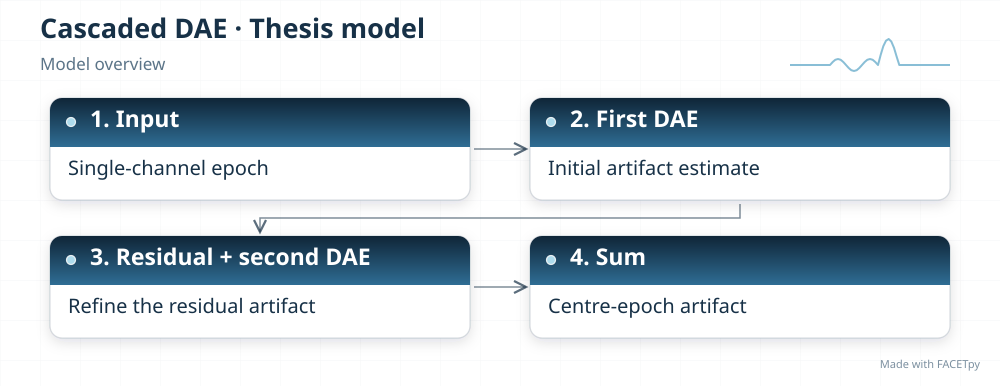
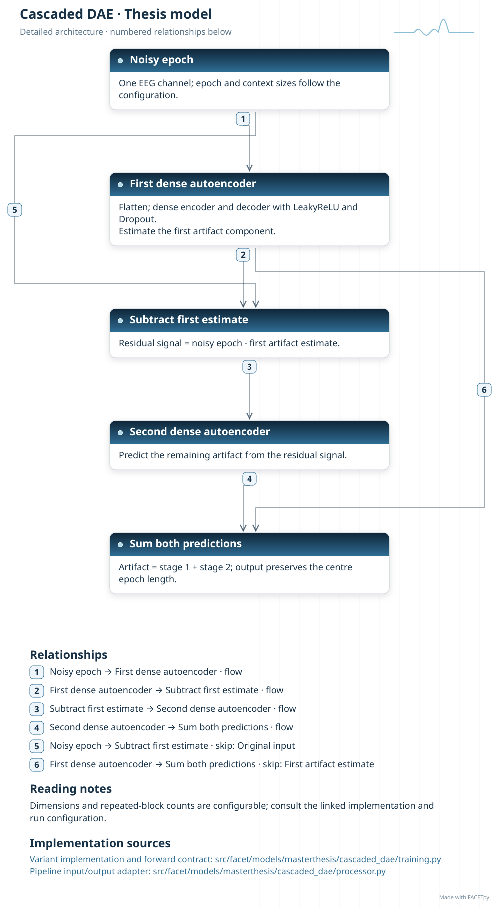
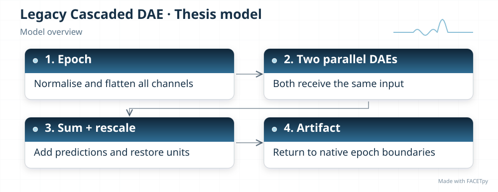
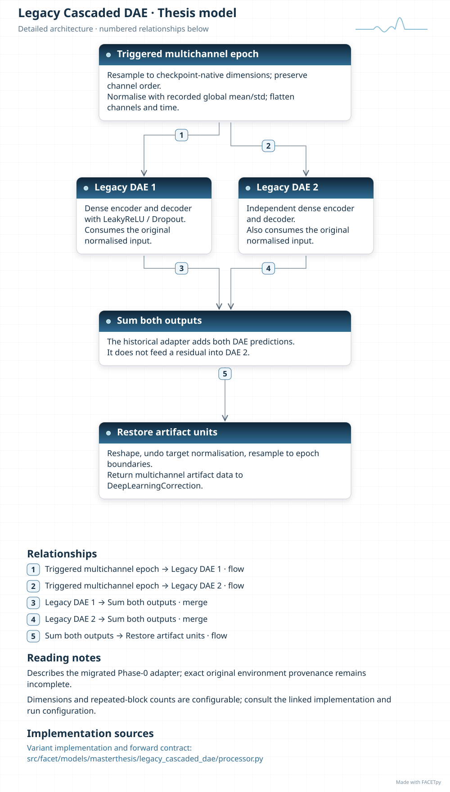
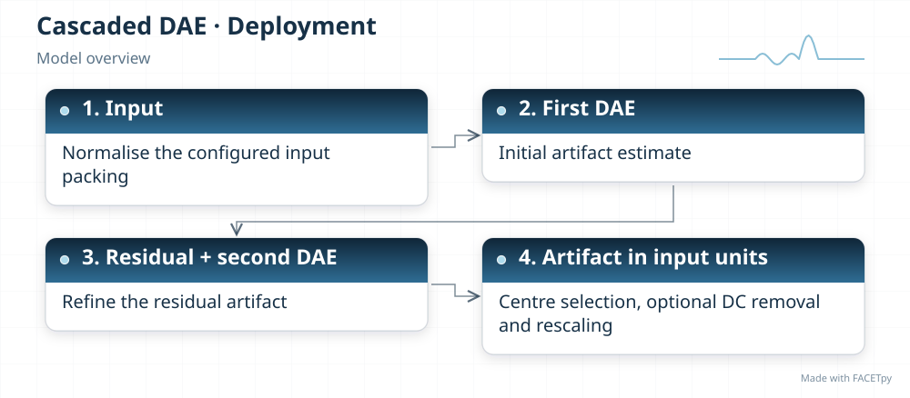
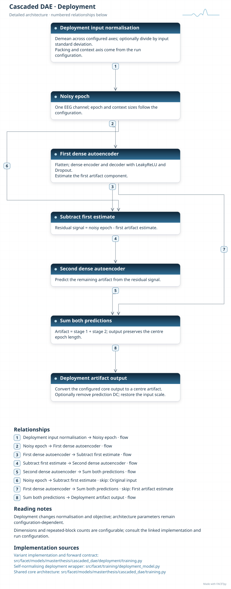

Cascaded DAE
============

A denoising autoencoder (DAE) compresses a signal and learns to reconstruct a target.
Here, two stages estimate the artifact. The first makes an initial estimate. The second
receives the remaining signal and estimates the artifact left in it. FACETpy adds the
two predictions before subtraction.

Family and origin
-----------------

**Architecture:** Fully connected denoising autoencoder.

**Origin:** Gradient artifact correction in simultaneous EEG-fMRI; Duffy et al. (2020).

The thesis identifies Duffy, Toga and Kim [Duffy2020]_ as the source of this
model family. Their work applies denoising autoencoders to gradient artifact
correction in simultaneous EEG-fMRI. FACETpy adapts that approach in its
single-epoch, context and retained Phase-0 implementations.

FACETpy adaptation
------------------

The current model processes one epoch of one EEG channel. The migrated Phase-0 model is
a separate implementation: both of its autoencoders receive the same flattened
multichannel input. It is therefore a parallel sum, despite the historical name. It must
not be described as the current residual cascade.

Implementation and input
------------------------

The main package is ``facet.models.masterthesis.cascaded_dae``. The recorded adapter contract is
**single epoch, one channel**. Input packing, demeaning and reconstruction are part of the
experiment; a family name alone does not identify them.

The base and deployment variants have separate factories. Select their input
packing, output type and normalization together with the checkpoint. A dataset
may store seven epochs even when a single-epoch adapter uses only the centre.

Experiments and evidence
------------------------

Use :doc:`../../masterthesis_guide/catalog` to select the phase, exact variant,
configuration and weights. :doc:`../selected_variants` explains how comparisons
differ. The family reference is not a claim of validated paper fidelity.

The seven-epoch configuration in thesis Figure 8 and Table 5 belongs to
``deployment_cascaded_context_dae`` (batch size 64). Select that experiment for
those references. The single-epoch ``deployment_cascaded_dae`` arm (batch size
128) is a separate result. Both remain available; see :doc:`context_dae`.

Variants and lineage
--------------------

The diagrams below describe each retained variant and its input/output contract.
Select the matching experiment and checkpoint through the catalog.

Source-paper record
-------------------

Duffy, Toga and Kim (2020), *Gradient Artifact Correction for Simultaneous
EEG-fMRI using Denoising Autoencoders* [Duffy2020]_. See
:doc:`../model_references` for the full reference and DOI.

The paper is the family source named in the thesis. The implementation details
above describe the retained FACETpy variants; they do not establish exact
reproduction of the paper's architecture, training or results.

Architecture diagrams
---------------------

Each variant has a compact overview and an expandable detailed diagram. The
editable profiles link the implementation sources. Dimensions and repeated
blocks depend on the selected configuration.

.. model-diagrams-start

.. Generated by tools/diagrams/build_model_diagrams.py; edit model profiles and READMEs.

.. _diagram-masterthesis-cascaded-dae:

Cascaded DAE
~~~~~~~~~~~~

Variant: ``masterthesis/cascaded_dae``.

Fully connected denoising autoencoder. Two fully connected stages predict an artifact from one channel and one epoch. Stage two receives the signal after the first estimate is subtracted.

   Compact overview; native print size is within half an A4 page.

.. raw:: html

   

   
Show detailed architecture

   Detailed data paths, branches and implementation sources.

.. raw:: html

   

:download:`Overview (SVG) <../../../../src/facet/models/masterthesis/cascaded_dae/diagrams/overview.svg>`
|
:download:`Detailed architecture (SVG) <../../../../src/facet/models/masterthesis/cascaded_dae/diagrams/architecture.svg>`
|
:download:`Editable profile (JSON) <../../../../src/facet/models/masterthesis/cascaded_dae/diagrams/architecture.json>`

.. _diagram-masterthesis-legacy-cascaded-dae:

Legacy Cascaded DAE
~~~~~~~~~~~~~~~~~~~

Variant: ``masterthesis/legacy_cascaded_dae``.

Fully connected denoising autoencoder. Migrated Phase-0 adapter: two fully connected autoencoders receive the same flattened multichannel epoch, and their predictions are added. The adapter changes segmentation and resampling; it does not reproduce the original FACETpy 0.1.0 environment.

   Compact overview; native print size is within half an A4 page.

.. raw:: html

   

   
Show detailed architecture

   Detailed data paths, branches and implementation sources.

.. raw:: html

   

:download:`Overview (SVG) <../../../../src/facet/models/masterthesis/legacy_cascaded_dae/diagrams/overview.svg>`
|
:download:`Detailed architecture (SVG) <../../../../src/facet/models/masterthesis/legacy_cascaded_dae/diagrams/architecture.svg>`
|
:download:`Editable profile (JSON) <../../../../src/facet/models/masterthesis/legacy_cascaded_dae/diagrams/architecture.json>`

.. _diagram-masterthesis-cascaded-dae-deployment:

Cascaded DAE — deployment
~~~~~~~~~~~~~~~~~~~~~~~~~

Variant: ``masterthesis/cascaded_dae/deployment``.

Fully connected denoising autoencoder. Two fully connected stages predict an artifact from one channel and one epoch. Stage two receives the signal after the first estimate is subtracted. The deployment wrapper normalizes input, restores output units and can remove the predicted epoch mean. Its objective scores recovered clean EEG.

   Compact overview; native print size is within half an A4 page.

.. raw:: html

   

   
Show detailed architecture

   Detailed data paths, branches and implementation sources.

.. raw:: html

   

:download:`Overview (SVG) <../../../../src/facet/models/masterthesis/cascaded_dae/deployment/diagrams/overview.svg>`
|
:download:`Detailed architecture (SVG) <../../../../src/facet/models/masterthesis/cascaded_dae/deployment/diagrams/architecture.svg>`
|
:download:`Editable profile (JSON) <../../../../src/facet/models/masterthesis/cascaded_dae/deployment/diagrams/architecture.json>`

.. model-diagrams-end
