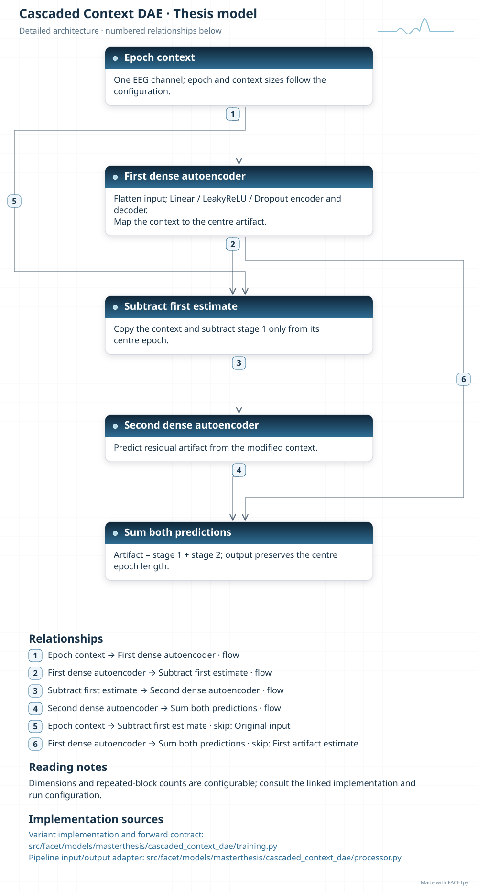
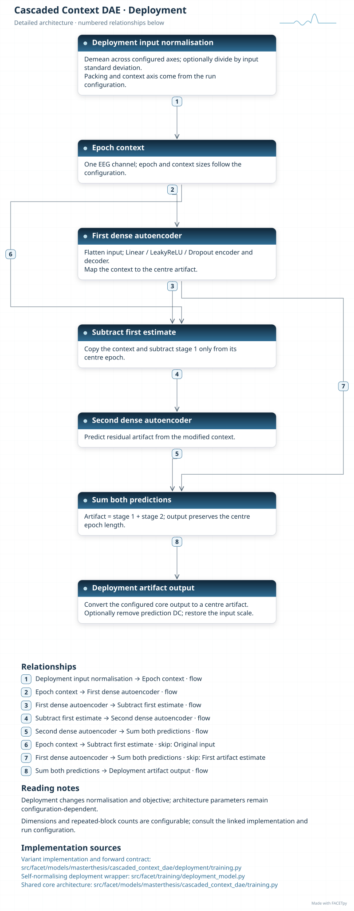

Context DAE
===========

Context DAE uses neighbouring epochs to estimate the artifact in the centre epoch. Two
autoencoders work in sequence. After the first prediction, the model subtracts that
estimate from the centre slot of the context. The second stage then estimates the
remaining artifact.

Family and origin
-----------------

**Architecture:** Fully connected context autoencoder.

**Origin:** FACETpy context extension of the Duffy et al. Cascaded DAE family.

This model extends the :doc:`cascaded_dae` family attributed to Duffy et al.
[Duffy2020]_ in the thesis. FACETpy adds seven-epoch context to estimate the
centre artifact. The context input is a project adaptation of that family.

FACETpy adaptation
------------------

The recorded input contains seven epochs from one channel. Both stages return only the
centre-epoch artifact. Neighbouring epochs supply context; they are not additional
output channels. Context length and channel count describe different axes.

Implementation and input
------------------------

The main package is ``facet.models.masterthesis.cascaded_context_dae``. The recorded adapter contract is
**seven epochs, one channel**. Input packing, demeaning and reconstruction are part of the
experiment; a family name alone does not identify them.

The base and deployment variants have separate factories. Select their input
packing, output type and normalization together with the checkpoint. A dataset
may store seven epochs even when a single-epoch adapter uses only the centre.

Experiments and evidence
------------------------

Use :doc:`../../masterthesis_guide/catalog` to select the phase, exact variant,
configuration and weights. :doc:`../selected_variants` explains how comparisons
differ. The family reference is not a claim of validated paper fidelity.

Variants and lineage
--------------------

The diagrams below describe each retained variant and its input/output contract.
Select the matching experiment and checkpoint through the catalog.

Source-paper record
-------------------

The parent family follows Duffy, Toga and Kim [Duffy2020]_. See
:doc:`../model_references` for the full reference and DOI, and
:doc:`cascaded_dae` for the shared lineage. The seven-epoch context describes
this FACETpy variant; it is not presented as a verified feature of the paper.

Architecture diagrams
---------------------

Each variant has a compact overview and an expandable detailed diagram. The
editable profiles link the implementation sources. Dimensions and repeated
blocks depend on the selected configuration.

.. model-diagrams-start

.. Generated by tools/diagrams/build_model_diagrams.py; edit model profiles and READMEs.

.. _diagram-masterthesis-cascaded-context-dae:

Cascaded Context DAE
~~~~~~~~~~~~~~~~~~~~

Variant: ``masterthesis/cascaded_context_dae``.

Fully connected context autoencoder. Two fully connected stages read seven epochs from one channel and predict the centre artifact. The second stage reads context with the first centre estimate removed.

.. figure:: ../../../../src/facet/models/masterthesis/cascaded_context_dae/diagrams/overview.svg
   :width: 190mm
   :alt: Cascaded Context DAE — compact model overview

   Compact overview; native print size is within half an A4 page.

.. raw:: html

   

   
Show detailed architecture

   Detailed data paths, branches and implementation sources.

.. raw:: html

   

:download:`Overview (SVG) <../../../../src/facet/models/masterthesis/cascaded_context_dae/diagrams/overview.svg>`
|
:download:`Detailed architecture (SVG) <../../../../src/facet/models/masterthesis/cascaded_context_dae/diagrams/architecture.svg>`
|
:download:`Editable profile (JSON) <../../../../src/facet/models/masterthesis/cascaded_context_dae/diagrams/architecture.json>`

.. _diagram-masterthesis-cascaded-context-dae-deployment:

Cascaded Context DAE — deployment
~~~~~~~~~~~~~~~~~~~~~~~~~~~~~~~~~

Variant: ``masterthesis/cascaded_context_dae/deployment``.

Fully connected context autoencoder. Two fully connected stages read seven epochs from one channel and predict the centre artifact. The second stage reads context with the first centre estimate removed. The deployment wrapper normalizes input, restores output units and can remove the predicted epoch mean. Its objective scores recovered clean EEG.

.. figure:: ../../../../src/facet/models/masterthesis/cascaded_context_dae/deployment/diagrams/overview.svg
   :width: 190mm
   :alt: Cascaded Context DAE — deployment — compact model overview

   Compact overview; native print size is within half an A4 page.

.. raw:: html

   

   
Show detailed architecture

   Detailed data paths, branches and implementation sources.

.. raw:: html

   

:download:`Overview (SVG) <../../../../src/facet/models/masterthesis/cascaded_context_dae/deployment/diagrams/overview.svg>`
|
:download:`Detailed architecture (SVG) <../../../../src/facet/models/masterthesis/cascaded_context_dae/deployment/diagrams/architecture.svg>`
|
:download:`Editable profile (JSON) <../../../../src/facet/models/masterthesis/cascaded_context_dae/deployment/diagrams/architecture.json>`

.. model-diagrams-end
