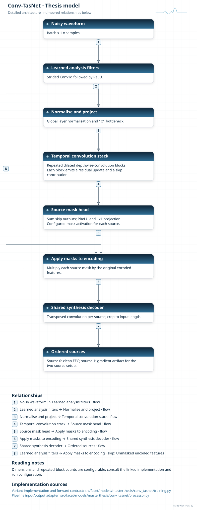
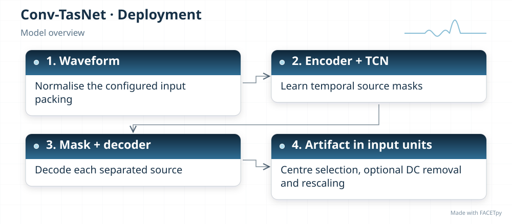
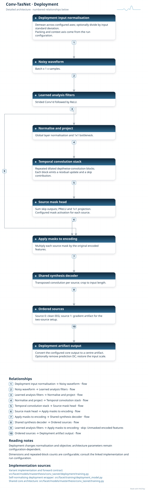
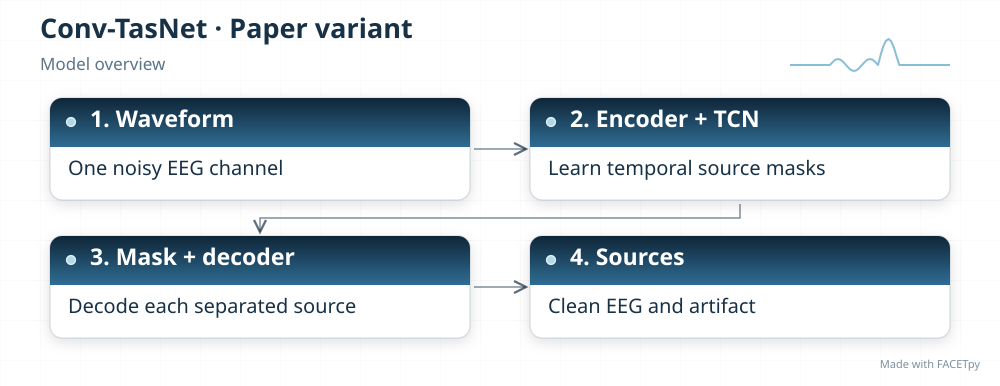
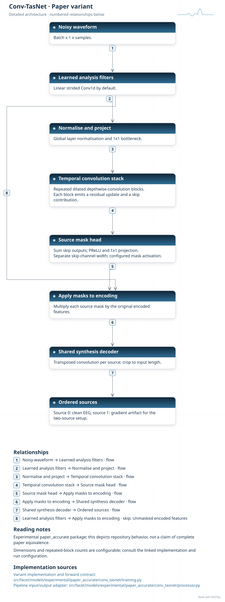

Conv-TasNet
===========

Conv-TasNet learns short waveform features, estimates a mask for each source, and
decodes the masked features back into signals. Dilated temporal convolutions let the
mask network combine nearby and more distant samples.

Family and origin
-----------------

**Architecture:** Convolutional source separator.

**Origin:** Speech separation.

Luo and Mesgarani introduced Conv-TasNet for separating speakers [Luo2019]_. FACETpy
adapts that separation pattern to clean EEG and gradient artifact.

FACETpy adaptation
------------------

The base model processes one channel and one epoch. Its two outputs have fixed meanings:
clean EEG and artifact. These ordered targets differ from a speech task where speaker
order can be unknown. Input scale and the selected source must agree with the correction
adapter.

Implementation and input
------------------------

The main package is ``facet.models.masterthesis.conv_tasnet``. The recorded adapter contract is
**single epoch, one channel**. Input packing, demeaning and reconstruction are part of the
experiment; a family name alone does not identify them.

The base and deployment variants have separate factories. Select their input
packing, output type and normalization together with the checkpoint. A dataset
may store seven epochs even when a single-epoch adapter uses only the centre.

Experiments and evidence
------------------------

Use :doc:`../../masterthesis_guide/catalog` to select the phase, exact variant,
configuration and weights. :doc:`../selected_variants` explains how comparisons
differ. The family reference is not a claim of validated paper fidelity.

Variants and lineage
--------------------

The diagrams below describe each retained variant and its input/output contract.
Select the matching experiment and checkpoint through the catalog.

Source-paper record
-------------------

Sources: [Luo2019]_. See :doc:`../model_references` for full references.

A source citation explains the design lineage. It does not establish that a
FACETpy checkpoint reproduces the source paper's training or results.

Architecture diagrams
---------------------

Each variant has a compact overview and an expandable detailed diagram. The
editable profiles link the implementation sources. Dimensions and repeated
blocks depend on the selected configuration.

.. model-diagrams-start

.. Generated by tools/diagrams/build_model_diagrams.py; edit model profiles and READMEs.

.. _diagram-masterthesis-conv-tasnet:

Conv-TasNet
~~~~~~~~~~~

Variant: ``masterthesis/conv_tasnet``.

Convolutional source separator. A learned waveform encoder, temporal convolution network and decoder separate ordered clean-EEG and artifact targets.

   Compact overview; native print size is within half an A4 page.

.. raw:: html

   

   
Show detailed architecture

   Detailed data paths, branches and implementation sources.

.. raw:: html

   

:download:`Overview (SVG) <../../../../src/facet/models/masterthesis/conv_tasnet/diagrams/overview.svg>`
|
:download:`Detailed architecture (SVG) <../../../../src/facet/models/masterthesis/conv_tasnet/diagrams/architecture.svg>`
|
:download:`Editable profile (JSON) <../../../../src/facet/models/masterthesis/conv_tasnet/diagrams/architecture.json>`

.. raw:: html

   

   
Results: hyperparameters, training curves and evaluation

.. include:: ../../../../src/facet/models/masterthesis/conv_tasnet/diagrams/../results/index.rst

.. raw:: html

   

.. _diagram-masterthesis-conv-tasnet-deployment:

Conv-TasNet — deployment
~~~~~~~~~~~~~~~~~~~~~~~~

Variant: ``masterthesis/conv_tasnet/deployment``.

Convolutional source separator. A learned waveform encoder, temporal convolution network and decoder separate ordered clean-EEG and artifact targets. The deployment wrapper normalizes input, restores output units and can remove the predicted epoch mean. Its objective scores recovered clean EEG.

   Compact overview; native print size is within half an A4 page.

.. raw:: html

   

   
Show detailed architecture

   Detailed data paths, branches and implementation sources.

.. raw:: html

   

:download:`Overview (SVG) <../../../../src/facet/models/masterthesis/conv_tasnet/deployment/diagrams/overview.svg>`
|
:download:`Detailed architecture (SVG) <../../../../src/facet/models/masterthesis/conv_tasnet/deployment/diagrams/architecture.svg>`
|
:download:`Editable profile (JSON) <../../../../src/facet/models/masterthesis/conv_tasnet/deployment/diagrams/architecture.json>`

.. raw:: html

   

   
Results: hyperparameters, training curves and evaluation

.. include:: ../../../../src/facet/models/masterthesis/conv_tasnet/deployment/diagrams/../results/index.rst

.. raw:: html

   

.. _diagram-experimental-paper-accurate-conv-tasnet:

Conv-TasNet — experimental paper_accurate
~~~~~~~~~~~~~~~~~~~~~~~~~~~~~~~~~~~~~~~~~

Variant: ``experimental/paper_accurate/conv_tasnet``.

Convolutional source separator. This experimental variant uses a linear encoder with sigmoid masks and a separate skip-channel width. Its default loss scores ordered EEG and artifact targets; it does not reproduce the speech training protocol.

   Compact overview; native print size is within half an A4 page.

.. raw:: html

   

   
Show detailed architecture

   Detailed data paths, branches and implementation sources.

.. raw:: html

   

:download:`Overview (SVG) <../../../../src/facet/models/experimental/paper_accurate/conv_tasnet/diagrams/overview.svg>`
|
:download:`Detailed architecture (SVG) <../../../../src/facet/models/experimental/paper_accurate/conv_tasnet/diagrams/architecture.svg>`
|
:download:`Editable profile (JSON) <../../../../src/facet/models/experimental/paper_accurate/conv_tasnet/diagrams/architecture.json>`

.. raw:: html

   

   
Results: hyperparameters, training curves and evaluation

.. include:: ../../../../src/facet/models/experimental/paper_accurate/conv_tasnet/diagrams/../results/index.rst

.. raw:: html

   

.. model-diagrams-end
