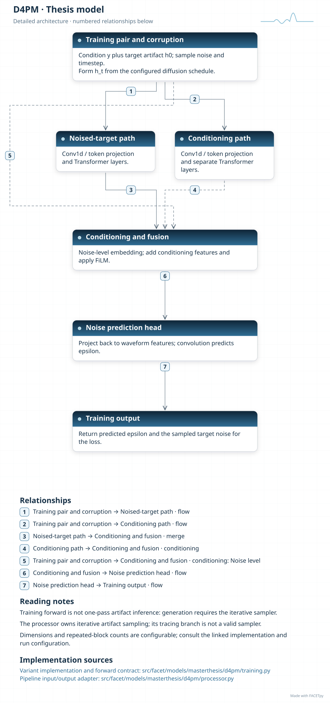
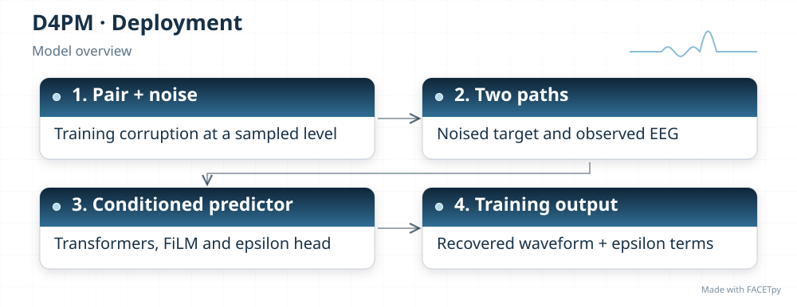
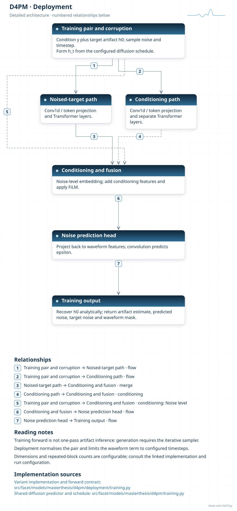
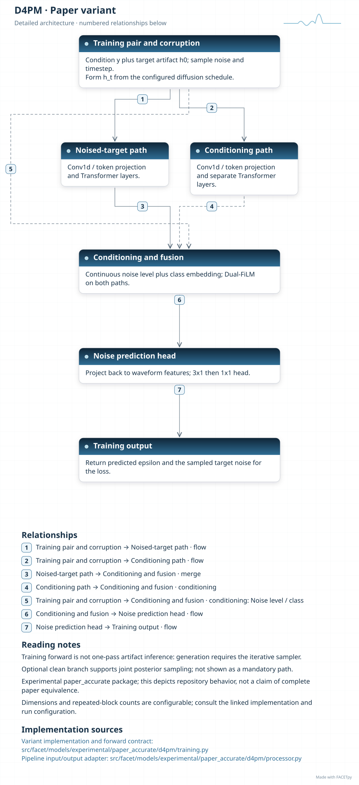

D4PM
====

D4PM learns to remove noise added to a target during training. At inference, a sampler
applies the learned predictor repeatedly, using the observed EEG as a condition. One
training forward pass is not the complete correction procedure.

Family and origin
-----------------

**Architecture:** Conditional diffusion model.

**Origin:** EEG artifact removal.

Shao et al. proposed a dual-branch diffusion model for clean EEG and artifact, with
joint posterior sampling [Shao2025]_. The FACETpy base model retains a simpler
artifact-prediction path.

FACETpy adaptation
------------------

Two feature paths inside a predictor must not be confused with two separate clean and
artifact diffusion branches. The base implementation has the former. The experimental
edition can add the latter with an optional clean branch. The sampler, noise schedule
and target are part of the model contract.

Implementation and input
------------------------

The main package is ``facet.models.masterthesis.d4pm``. The recorded adapter contract is
**single epoch, one channel**. Input packing, demeaning and reconstruction are part of the
experiment; a family name alone does not identify them.

The base and deployment variants have separate factories. Select their input
packing, output type and normalization together with the checkpoint. A dataset
may store seven epochs even when a single-epoch adapter uses only the centre.

Phase 1 uses the Python training module and its reverse-diffusion sampler.
The original TorchScript stub does not contain that sampler. Phase 2 has no
completed pipeline result for D4PM; preserved training records do not establish
successful deployment.

Experiments and evidence
------------------------

Use :doc:`../../masterthesis_guide/catalog` to select the phase, exact variant,
configuration and weights. :doc:`../selected_variants` explains how comparisons
differ. The family reference is not a claim of validated paper fidelity.

Variants and lineage
--------------------

The diagrams below describe each retained variant and its input/output contract.
Select the matching experiment and checkpoint through the catalog.

Source-paper record
-------------------

Sources: [Shao2025]_. See :doc:`../model_references` for full references.

A source citation explains the design lineage. It does not establish that a
FACETpy checkpoint reproduces the source paper's training or results.

Architecture diagrams
---------------------

Each variant has a compact overview and an expandable detailed diagram. The
editable profiles link the implementation sources. Dimensions and repeated
blocks depend on the selected configuration.

.. model-diagrams-start

.. Generated by tools/diagrams/build_model_diagrams.py; edit model profiles and READMEs.

.. _diagram-masterthesis-d4pm:

D4PM
~~~~

Variant: ``masterthesis/d4pm``.

Conditional diffusion model. A conditional noise predictor learns the artifact distribution for one EEG channel and epoch. Artifact inference requires its iterative reverse-diffusion sampler.

   Compact overview; native print size is within half an A4 page.

.. raw:: html

   

   
Show detailed architecture

   Detailed data paths, branches and implementation sources.

.. raw:: html

   

:download:`Overview (SVG) <../../../../src/facet/models/masterthesis/d4pm/diagrams/overview.svg>`
|
:download:`Detailed architecture (SVG) <../../../../src/facet/models/masterthesis/d4pm/diagrams/architecture.svg>`
|
:download:`Editable profile (JSON) <../../../../src/facet/models/masterthesis/d4pm/diagrams/architecture.json>`

.. _diagram-masterthesis-d4pm-deployment:

D4PM — deployment
~~~~~~~~~~~~~~~~~

Variant: ``masterthesis/d4pm/deployment``.

Conditional diffusion model. This deployment variant normalizes the training pair and adds a recovered-waveform objective at configured diffusion timesteps. Inference still requires an iterative sampler. The retained record contains no completed Phase-2 pipeline result.

   Compact overview; native print size is within half an A4 page.

.. raw:: html

   

   
Show detailed architecture

   Detailed data paths, branches and implementation sources.

.. raw:: html

   

:download:`Overview (SVG) <../../../../src/facet/models/masterthesis/d4pm/deployment/diagrams/overview.svg>`
|
:download:`Detailed architecture (SVG) <../../../../src/facet/models/masterthesis/d4pm/deployment/diagrams/architecture.svg>`
|
:download:`Editable profile (JSON) <../../../../src/facet/models/masterthesis/d4pm/deployment/diagrams/architecture.json>`

.. _diagram-experimental-paper-accurate-d4pm:

D4PM — experimental paper_accurate
~~~~~~~~~~~~~~~~~~~~~~~~~~~~~~~~~~

Variant: ``experimental/paper_accurate/d4pm``.

Conditional diffusion model. This experimental variant adds continuous noise-level and artifact-class conditioning. An optional clean branch supports joint posterior sampling; enable it explicitly in the configuration.

   Compact overview; native print size is within half an A4 page.

.. raw:: html

   

   
Show detailed architecture

   Detailed data paths, branches and implementation sources.

.. raw:: html

   

:download:`Overview (SVG) <../../../../src/facet/models/experimental/paper_accurate/d4pm/diagrams/overview.svg>`
|
:download:`Detailed architecture (SVG) <../../../../src/facet/models/experimental/paper_accurate/d4pm/diagrams/architecture.svg>`
|
:download:`Editable profile (JSON) <../../../../src/facet/models/experimental/paper_accurate/d4pm/diagrams/architecture.json>`

.. model-diagrams-end
