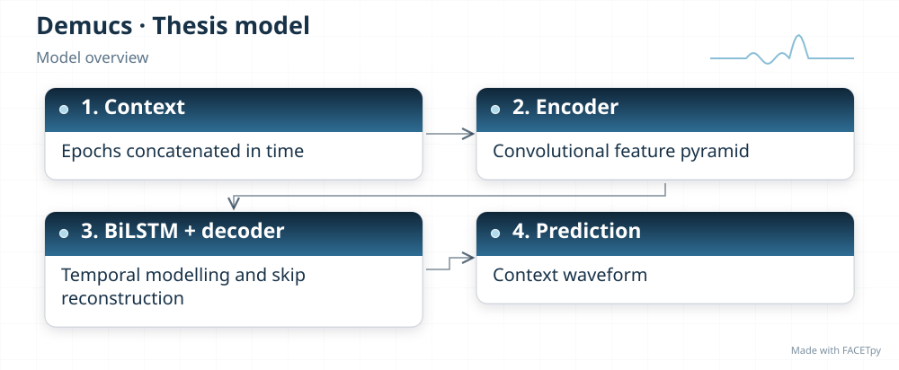
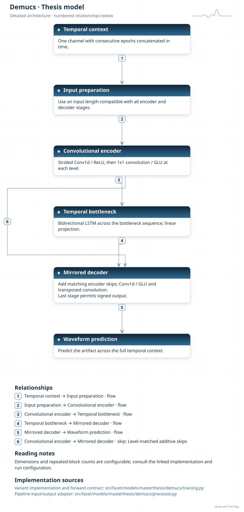
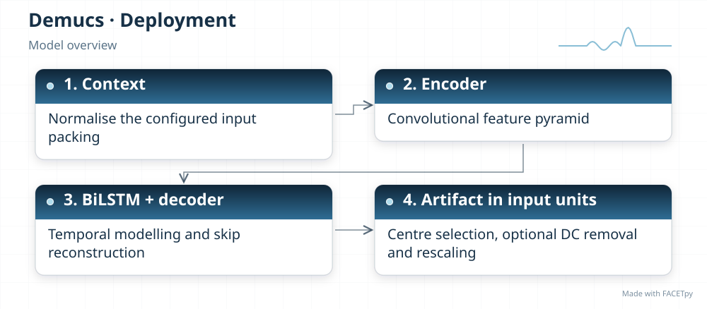
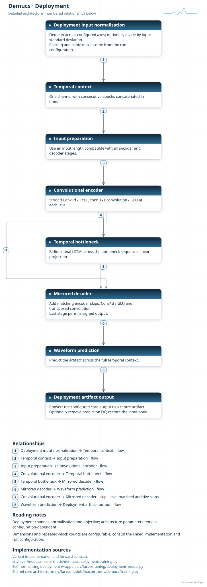
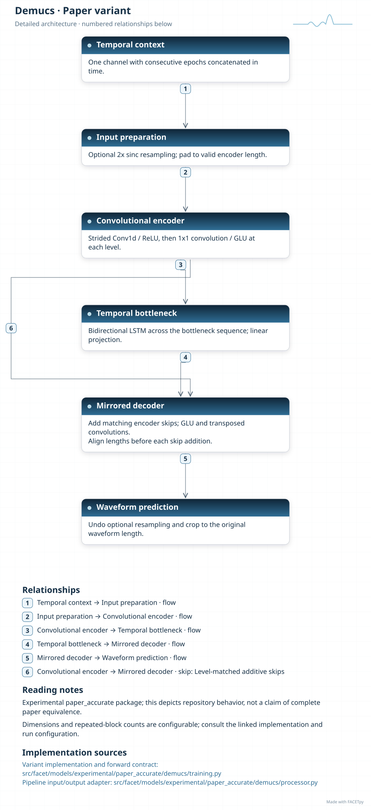

Demucs
======

Demucs compresses a waveform through convolutional layers, models its temporal
structure, and expands it back to a waveform. Skip connections return fine detail from
the encoder to the decoder. A bidirectional long short-term memory network (BiLSTM)
processes the compressed sequence in both directions.

Family and origin
-----------------

**Architecture:** Waveform encoder-decoder with recurrent processing.

**Origin:** Music source separation.

Défossez et al. introduced Demucs to separate instruments and vocals in music
[Defossez2019]_. This family follows the waveform architecture described in that paper.

FACETpy adaptation
------------------

FACETpy concatenates neighbouring epochs from one EEG channel in time. The network
predicts an artifact waveform across that context; the correction adapter selects the
required epoch. The training target, waveform length and model size come from the EEG
experiment, not the music benchmark.

Implementation and input
------------------------

The main package is ``facet.models.masterthesis.demucs``. The recorded adapter contract is
**seven concatenated epochs, one channel**. Input packing, demeaning and reconstruction are part of the
experiment; a family name alone does not identify them.

The base and deployment variants have separate factories. Select their input
packing, output type and normalization together with the checkpoint. A dataset
may store seven epochs even when a single-epoch adapter uses only the centre.

Experiments and evidence
------------------------

Use :doc:`../../masterthesis_guide/catalog` to select the phase, exact variant,
configuration and weights. :doc:`../selected_variants` explains how comparisons
differ. The family reference is not a claim of validated paper fidelity.

Variants and lineage
--------------------

The diagrams below describe each retained variant and its input/output contract.
Select the matching experiment and checkpoint through the catalog.

Source-paper record
-------------------

Sources: [Defossez2019]_. See :doc:`../model_references` for full references.

A source citation explains the design lineage. It does not establish that a
FACETpy checkpoint reproduces the source paper's training or results.

Architecture diagrams
---------------------

Each variant has a compact overview and an expandable detailed diagram. The
editable profiles link the implementation sources. Dimensions and repeated
blocks depend on the selected configuration.

.. model-diagrams-start

.. Generated by tools/diagrams/build_model_diagrams.py; edit model profiles and READMEs.

.. _diagram-masterthesis-demucs:

Demucs
~~~~~~

Variant: ``masterthesis/demucs``.

Waveform encoder-decoder with recurrent processing. A convolutional encoder, bidirectional recurrent bottleneck and skip decoder predict the artifact across concatenated EEG epochs.

   Compact overview; native print size is within half an A4 page.

.. raw:: html

   

   
Show detailed architecture

   Detailed data paths, branches and implementation sources.

.. raw:: html

   

:download:`Overview (SVG) <../../../../src/facet/models/masterthesis/demucs/diagrams/overview.svg>`
|
:download:`Detailed architecture (SVG) <../../../../src/facet/models/masterthesis/demucs/diagrams/architecture.svg>`
|
:download:`Editable profile (JSON) <../../../../src/facet/models/masterthesis/demucs/diagrams/architecture.json>`

.. _diagram-masterthesis-demucs-deployment:

Demucs — deployment
~~~~~~~~~~~~~~~~~~~

Variant: ``masterthesis/demucs/deployment``.

Waveform encoder-decoder with recurrent processing. A convolutional encoder, bidirectional recurrent bottleneck and skip decoder predict the artifact across concatenated EEG epochs. The deployment wrapper normalizes input, restores output units and can remove the predicted epoch mean. Its objective scores recovered clean EEG.

   Compact overview; native print size is within half an A4 page.

.. raw:: html

   

   
Show detailed architecture

   Detailed data paths, branches and implementation sources.

.. raw:: html

   

:download:`Overview (SVG) <../../../../src/facet/models/masterthesis/demucs/deployment/diagrams/overview.svg>`
|
:download:`Detailed architecture (SVG) <../../../../src/facet/models/masterthesis/demucs/deployment/diagrams/architecture.svg>`
|
:download:`Editable profile (JSON) <../../../../src/facet/models/masterthesis/demucs/deployment/diagrams/architecture.json>`

.. _diagram-experimental-paper-accurate-demucs:

Demucs — experimental paper_accurate
~~~~~~~~~~~~~~~~~~~~~~~~~~~~~~~~~~~~

Variant: ``experimental/paper_accurate/demucs``.

Waveform encoder-decoder with recurrent processing. This experimental variant adds input-length alignment and optional internal resampling. It still predicts an EEG artifact and uses the FACETpy experiment configuration.

   Compact overview; native print size is within half an A4 page.

.. raw:: html

   

   
Show detailed architecture

   Detailed data paths, branches and implementation sources.

.. raw:: html

   

:download:`Overview (SVG) <../../../../src/facet/models/experimental/paper_accurate/demucs/diagrams/overview.svg>`
|
:download:`Detailed architecture (SVG) <../../../../src/facet/models/experimental/paper_accurate/demucs/diagrams/architecture.svg>`
|
:download:`Editable profile (JSON) <../../../../src/facet/models/experimental/paper_accurate/demucs/diagrams/architecture.json>`

.. model-diagrams-end
