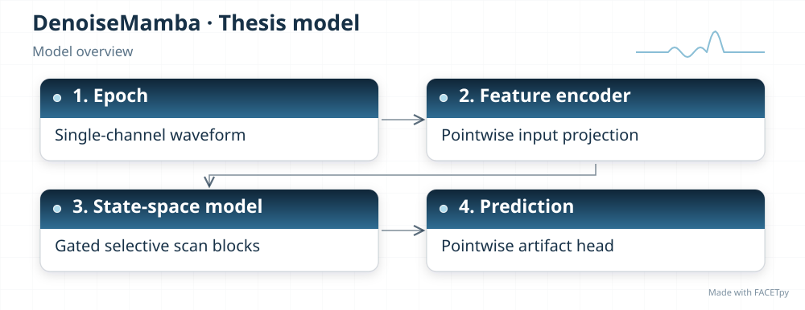
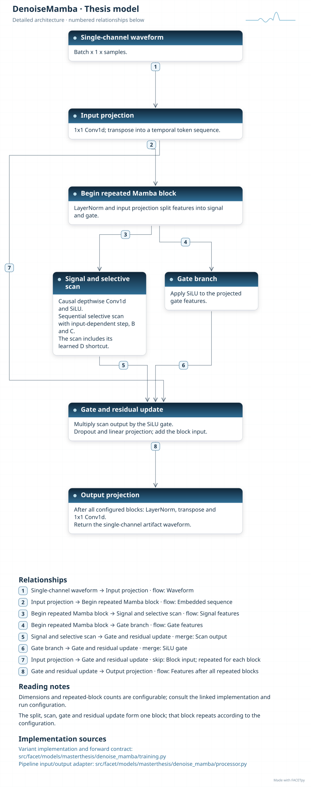
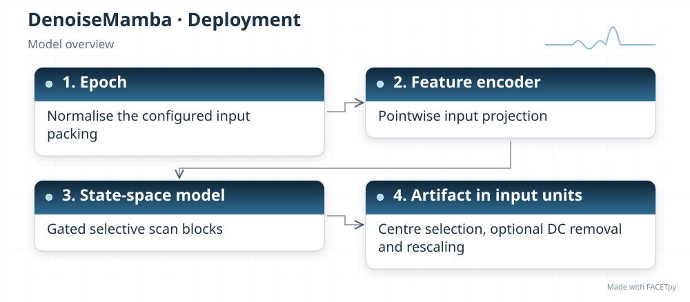
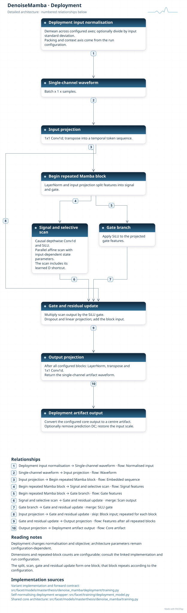
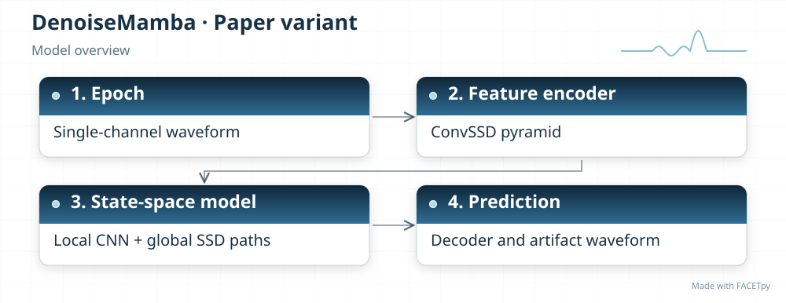
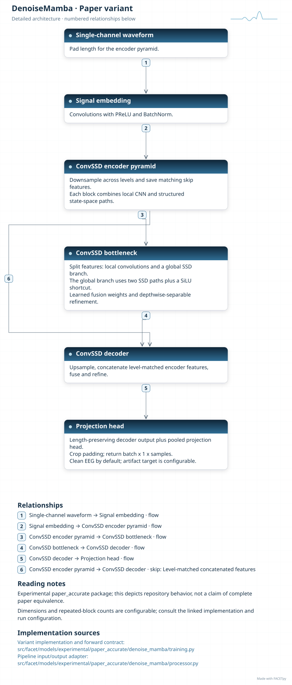

DenoiseMamba
============

A state-space layer carries a learned state through a sequence. DenoiseMamba combines
this temporal processing with local convolutions. The FACETpy variants use different
state-space blocks and must be identified by their full package names.

Family and origin
-----------------

**Architecture:** Convolutional and state-space model.

**Origin:** EEG artifact removal.

Chen et al. introduced DenoiseMamba for EEG artifact removal [Chen2025]_. The thesis
base implementation is a flat Mamba-1-style reconstruction. It does not implement the
paper's full U-shaped ConvSSD design.

FACETpy adaptation
------------------

The base model projects one channel into features, applies selective state-space blocks,
and predicts the artifact. The experimental edition uses an encoder-decoder with ConvSSD
blocks, which combine convolution and structured state-space duality (SSD). It replaces
a spatial scan with forward and reverse temporal scans for the single-channel task. Its
default target is clean EEG; artifact prediction is configurable.

Implementation and input
------------------------

The main package is ``facet.models.masterthesis.denoise_mamba``. The recorded adapter contract is
**single epoch, one channel**. Input packing, demeaning and reconstruction are part of the
experiment; a family name alone does not identify them.

The base and deployment variants have separate factories. Select their input
packing, output type and normalization together with the checkpoint. A dataset
may store seven epochs even when a single-epoch adapter uses only the centre.

The Phase-1 CPU path rebuilds the model from its state dictionary because the
original traced state-space scan contains a CUDA device. Select the source
checkpoint for that protocol.

Experiments and evidence
------------------------

Use :doc:`../../masterthesis_guide/catalog` to select the phase, exact variant,
configuration and weights. :doc:`../selected_variants` explains how comparisons
differ. The family reference is not a claim of validated paper fidelity.

Variants and lineage
--------------------

The diagrams below describe each retained variant and its input/output contract.
Select the matching experiment and checkpoint through the catalog.

Source-paper record
-------------------

Sources: [Chen2025]_. See :doc:`../model_references` for full references.

A source citation explains the design lineage. It does not establish that a
FACETpy checkpoint reproduces the source paper's training or results.

Architecture diagrams
---------------------

Each variant has a compact overview and an expandable detailed diagram. The
editable profiles link the implementation sources. Dimensions and repeated
blocks depend on the selected configuration.

.. model-diagrams-start

.. Generated by tools/diagrams/build_model_diagrams.py; edit model profiles and READMEs.

.. _diagram-masterthesis-denoise-mamba:

DenoiseMamba
~~~~~~~~~~~~

Variant: ``masterthesis/denoise_mamba``.

Convolutional and state-space model. A flat stack of local convolution and Mamba-1-style selective state-space blocks predicts a single-channel artifact. This is the thesis reconstruction, not the full published ConvSSD architecture.

   Compact overview; native print size is within half an A4 page.

.. raw:: html

   

   
Show detailed architecture

   Detailed data paths, branches and implementation sources.

.. raw:: html

   

:download:`Overview (SVG) <../../../../src/facet/models/masterthesis/denoise_mamba/diagrams/overview.svg>`
|
:download:`Detailed architecture (SVG) <../../../../src/facet/models/masterthesis/denoise_mamba/diagrams/architecture.svg>`
|
:download:`Editable profile (JSON) <../../../../src/facet/models/masterthesis/denoise_mamba/diagrams/architecture.json>`

.. _diagram-masterthesis-denoise-mamba-deployment:

DenoiseMamba — deployment
~~~~~~~~~~~~~~~~~~~~~~~~~

Variant: ``masterthesis/denoise_mamba/deployment``.

Convolutional and state-space model. A flat stack of local convolution and Mamba-1-style selective state-space blocks predicts a single-channel artifact. This is the thesis reconstruction, not the full published ConvSSD architecture. The deployment wrapper normalizes input, restores output units and can remove the predicted epoch mean. Its objective scores recovered clean EEG.

   Compact overview; native print size is within half an A4 page.

.. raw:: html

   

   
Show detailed architecture

   Detailed data paths, branches and implementation sources.

.. raw:: html

   

:download:`Overview (SVG) <../../../../src/facet/models/masterthesis/denoise_mamba/deployment/diagrams/overview.svg>`
|
:download:`Detailed architecture (SVG) <../../../../src/facet/models/masterthesis/denoise_mamba/deployment/diagrams/architecture.svg>`
|
:download:`Editable profile (JSON) <../../../../src/facet/models/masterthesis/denoise_mamba/deployment/diagrams/architecture.json>`

.. _diagram-experimental-paper-accurate-denoise-mamba:

DenoiseMamba — experimental paper_accurate
~~~~~~~~~~~~~~~~~~~~~~~~~~~~~~~~~~~~~~~~~~

Variant: ``experimental/paper_accurate/denoise_mamba``.

Convolutional and state-space model. This experimental variant uses a U-shaped ConvSSD encoder-decoder and Mamba-2-style state-space processing. It predicts clean EEG by default and can be configured to predict artifacts.

   Compact overview; native print size is within half an A4 page.

.. raw:: html

   

   
Show detailed architecture

   Detailed data paths, branches and implementation sources.

.. raw:: html

   

:download:`Overview (SVG) <../../../../src/facet/models/experimental/paper_accurate/denoise_mamba/diagrams/overview.svg>`
|
:download:`Detailed architecture (SVG) <../../../../src/facet/models/experimental/paper_accurate/denoise_mamba/diagrams/architecture.svg>`
|
:download:`Editable profile (JSON) <../../../../src/facet/models/experimental/paper_accurate/denoise_mamba/diagrams/architecture.json>`

.. model-diagrams-end
