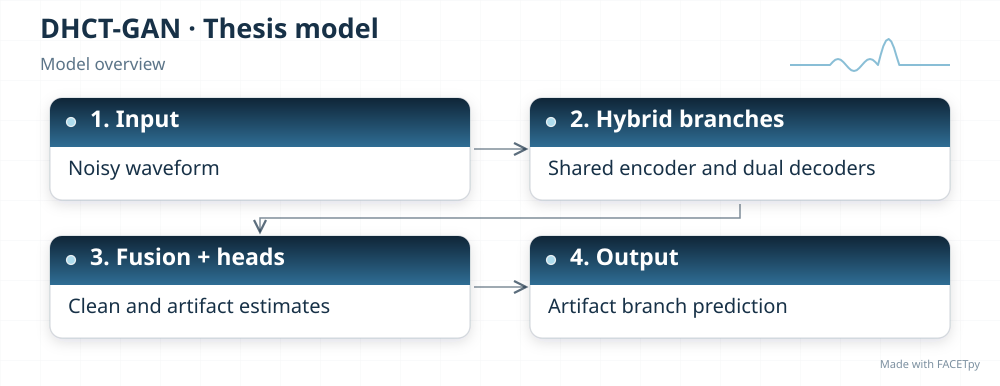
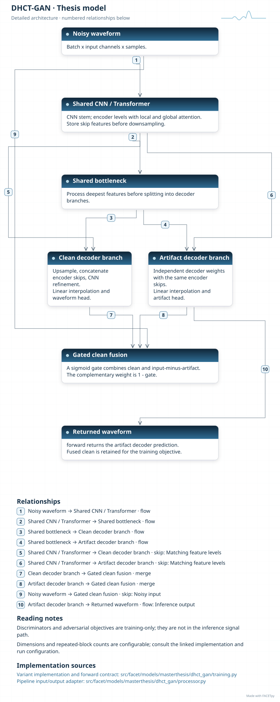
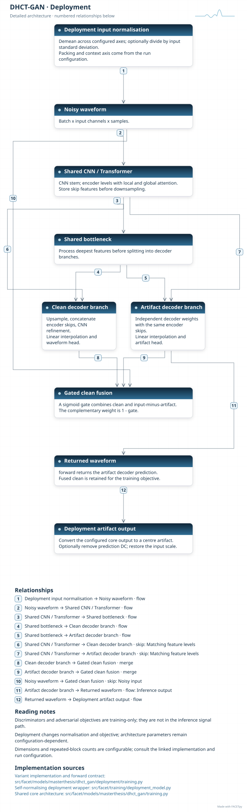
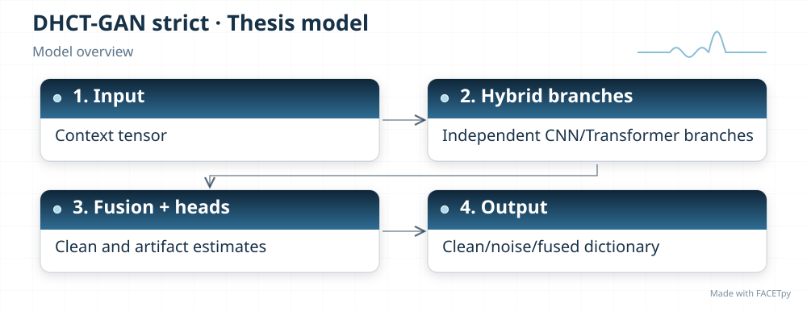
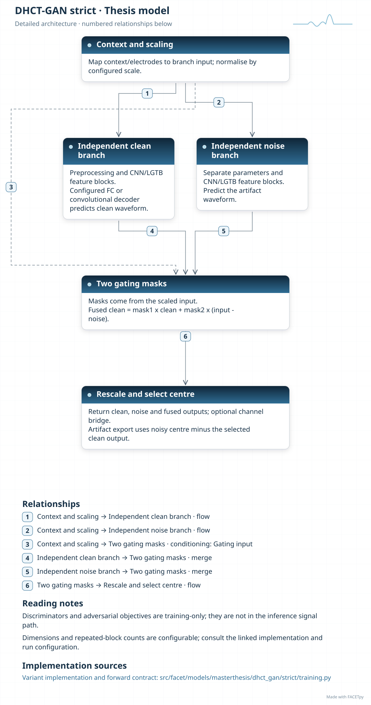
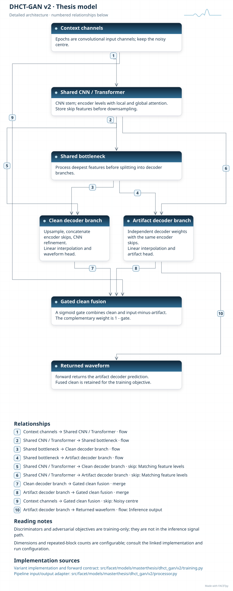
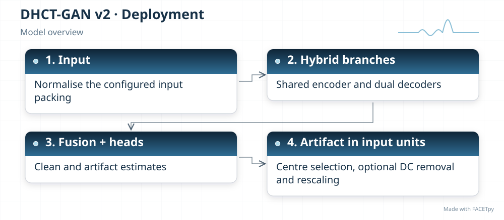
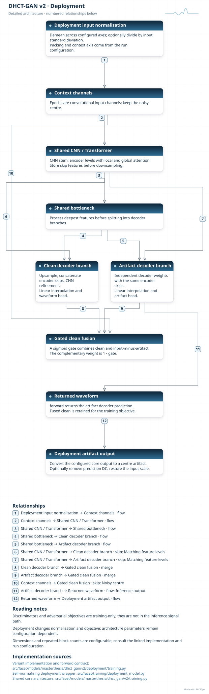
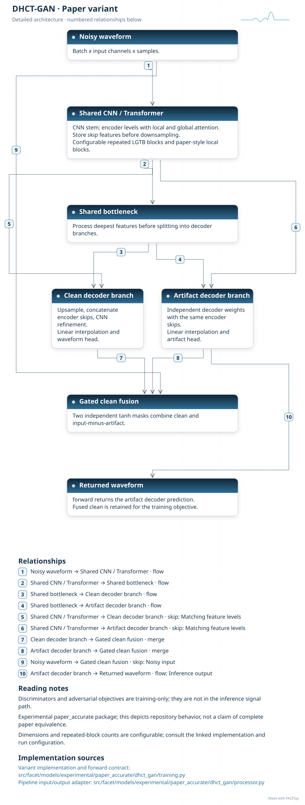
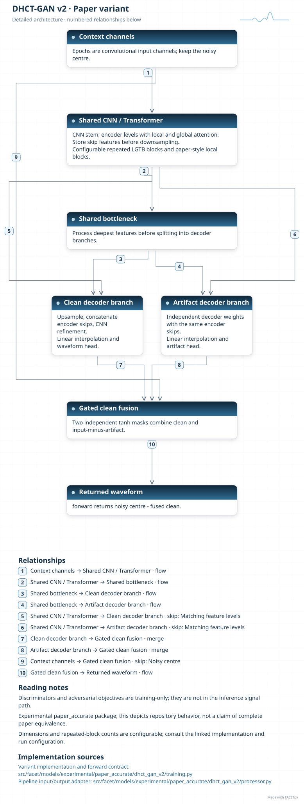

DHCT-GAN
========

DHCT-GAN learns features for clean EEG and artifact in separate branches. Convolutions
capture local patterns; attention combines information across the signal. Learned gates
combine branch estimates. Discriminators judge predictions during adversarial training
and are not part of the correction signal path.

Family and origin
-----------------

**Architecture:** Dual-branch convolution and attention model.

**Origin:** EEG artifact removal.

Cai, Meng and Huang introduced the dual-branch hybrid CNN-Transformer generative
adversarial network (DHCT-GAN) for EEG denoising [Cai2025]_. FACETpy retains several
adaptations with different branch, context and training contracts.

FACETpy adaptation
------------------

The base and V2 models share an encoder between their output branches. V2 adds
neighbouring epochs as input features. The strict implementation uses independent
branches and returns clean, noise and fused outputs for the adversarial training
wrapper. Its optional electrode-attention bridge is a FACETpy extension. The words
strict and paper_accurate identify packages, not verified equivalence of every
configuration to the paper.

Implementation and input
------------------------

The main package is ``facet.models.masterthesis.dhct_gan``. The recorded adapter contract is
**single epoch for the base implementation; seven epochs for V2, one channel**. Input packing, demeaning and reconstruction are part of the
experiment; a family name alone does not identify them.

The base and deployment variants have separate factories. Select their input
packing, output type and normalization together with the checkpoint. A dataset
may store seven epochs even when a single-epoch adapter uses only the centre.

The V2 implementation is under ``dhct_gan.v2``. It remains part of the thesis
collection because the thesis evaluates it. The two incomplete Phase-3 DHCT
trials do not constitute a completed 27-configuration tuning study.

Experiments and evidence
------------------------

Use :doc:`../../masterthesis_guide/catalog` to select the phase, exact variant,
configuration and weights. :doc:`../selected_variants` explains how comparisons
differ. The family reference is not a claim of validated paper fidelity.

Variants and lineage
--------------------

The diagrams below describe each retained variant and its input/output contract.
Select the matching experiment and checkpoint through the catalog.

Source-paper record
-------------------

Sources: [Cai2025]_. See :doc:`../model_references` for full references.

A source citation explains the design lineage. It does not establish that a
FACETpy checkpoint reproduces the source paper's training or results.

Architecture diagrams
---------------------

Each variant has a compact overview and an expandable detailed diagram. The
editable profiles link the implementation sources. Dimensions and repeated
blocks depend on the selected configuration.

.. model-diagrams-start

.. Generated by tools/diagrams/build_model_diagrams.py; edit model profiles and READMEs.

.. _diagram-masterthesis-dhct-gan:

DHCT-GAN
~~~~~~~~

Variant: ``masterthesis/dhct_gan``.

Dual-branch convolution and attention model. A shared encoder and two decoders estimate clean EEG and artifact from a single-channel epoch. The exported forward path returns the artifact branch.

   Compact overview; native print size is within half an A4 page.

.. raw:: html

   

   
Show detailed architecture

   Detailed data paths, branches and implementation sources.

.. raw:: html

   

:download:`Overview (SVG) <../../../../src/facet/models/masterthesis/dhct_gan/diagrams/overview.svg>`
|
:download:`Detailed architecture (SVG) <../../../../src/facet/models/masterthesis/dhct_gan/diagrams/architecture.svg>`
|
:download:`Editable profile (JSON) <../../../../src/facet/models/masterthesis/dhct_gan/diagrams/architecture.json>`

.. raw:: html

   

   
Results: hyperparameters, training curves and evaluation

.. include:: ../../../../src/facet/models/masterthesis/dhct_gan/diagrams/../results/index.rst

.. raw:: html

   

.. _diagram-masterthesis-dhct-gan-deployment:

DHCT-GAN — deployment
~~~~~~~~~~~~~~~~~~~~~

Variant: ``masterthesis/dhct_gan/deployment``.

Dual-branch convolution and attention model. A shared encoder and two decoders estimate clean EEG and artifact from a single-channel epoch. The exported forward path returns the artifact branch. The deployment wrapper normalizes input, restores output units and can remove the predicted epoch mean. Its objective scores recovered clean EEG.

   Compact overview; native print size is within half an A4 page.

.. raw:: html

   

   
Show detailed architecture

   Detailed data paths, branches and implementation sources.

.. raw:: html

   

:download:`Overview (SVG) <../../../../src/facet/models/masterthesis/dhct_gan/deployment/diagrams/overview.svg>`
|
:download:`Detailed architecture (SVG) <../../../../src/facet/models/masterthesis/dhct_gan/deployment/diagrams/architecture.svg>`
|
:download:`Editable profile (JSON) <../../../../src/facet/models/masterthesis/dhct_gan/deployment/diagrams/architecture.json>`

.. raw:: html

   

   
Results: hyperparameters, training curves and evaluation

.. include:: ../../../../src/facet/models/masterthesis/dhct_gan/deployment/diagrams/../results/index.rst

.. raw:: html

   

.. _diagram-masterthesis-dhct-gan-strict:

DHCT-GAN strict
~~~~~~~~~~~~~~~

Variant: ``masterthesis/dhct_gan/strict``.

Dual-branch convolution and attention model. Independent CNN/Transformer branches return clean, noise and fused outputs for adversarial training. An optional electrode-attention bridge and configurable decoder extend the source design; identify both in any reported result.

   Compact overview; native print size is within half an A4 page.

.. raw:: html

   

   
Show detailed architecture

   Detailed data paths, branches and implementation sources.

.. raw:: html

   

:download:`Overview (SVG) <../../../../src/facet/models/masterthesis/dhct_gan/strict/diagrams/overview.svg>`
|
:download:`Detailed architecture (SVG) <../../../../src/facet/models/masterthesis/dhct_gan/strict/diagrams/architecture.svg>`
|
:download:`Editable profile (JSON) <../../../../src/facet/models/masterthesis/dhct_gan/strict/diagrams/architecture.json>`

.. raw:: html

   

   
Results: hyperparameters, training curves and evaluation

.. include:: ../../../../src/facet/models/masterthesis/dhct_gan/strict/diagrams/../results/index.rst

.. raw:: html

   

.. _diagram-masterthesis-dhct-gan-v2:

DHCT-GAN v2
~~~~~~~~~~~

Variant: ``masterthesis/dhct_gan/v2``.

Dual-branch convolution and attention model. This thesis V2 variant stacks seven epochs as features for one electrode. A shared encoder and dual decoders predict the centre artifact. It differs from both the single-epoch base and the experimental paper_accurate V2 edition.

   Compact overview; native print size is within half an A4 page.

.. raw:: html

   

   
Show detailed architecture

   Detailed data paths, branches and implementation sources.

.. raw:: html

   

:download:`Overview (SVG) <../../../../src/facet/models/masterthesis/dhct_gan/v2/diagrams/overview.svg>`
|
:download:`Detailed architecture (SVG) <../../../../src/facet/models/masterthesis/dhct_gan/v2/diagrams/architecture.svg>`
|
:download:`Editable profile (JSON) <../../../../src/facet/models/masterthesis/dhct_gan/v2/diagrams/architecture.json>`

.. raw:: html

   

   
Results: hyperparameters, training curves and evaluation

.. include:: ../../../../src/facet/models/masterthesis/dhct_gan/v2/diagrams/../results/index.rst

.. raw:: html

   

.. _diagram-masterthesis-dhct-gan-v2-deployment:

DHCT-GAN v2 — deployment
~~~~~~~~~~~~~~~~~~~~~~~~

Variant: ``masterthesis/dhct_gan/v2/deployment``.

Dual-branch convolution and attention model. The V2 core reads neighbouring epochs as input features and predicts the centre artifact. The deployment wrapper normalizes input, restores output units and can remove the predicted epoch mean. Its objective scores recovered clean EEG.

   Compact overview; native print size is within half an A4 page.

.. raw:: html

   

   
Show detailed architecture

   Detailed data paths, branches and implementation sources.

.. raw:: html

   

:download:`Overview (SVG) <../../../../src/facet/models/masterthesis/dhct_gan/v2/deployment/diagrams/overview.svg>`
|
:download:`Detailed architecture (SVG) <../../../../src/facet/models/masterthesis/dhct_gan/v2/deployment/diagrams/architecture.svg>`
|
:download:`Editable profile (JSON) <../../../../src/facet/models/masterthesis/dhct_gan/v2/deployment/diagrams/architecture.json>`

.. raw:: html

   

   
Results: hyperparameters, training curves and evaluation

.. include:: ../../../../src/facet/models/masterthesis/dhct_gan/v2/deployment/diagrams/../results/index.rst

.. raw:: html

   

.. _diagram-experimental-paper-accurate-dhct-gan:

DHCT-GAN — experimental paper_accurate
~~~~~~~~~~~~~~~~~~~~~~~~~~~~~~~~~~~~~~

Variant: ``experimental/paper_accurate/dhct_gan``.

Dual-branch convolution and attention model. This experimental variant adds separate fusion gates, least-squares adversarial losses and discriminator feature matching. Its shared encoder and reduced EEG configuration remain FACETpy adaptations.

   Compact overview; native print size is within half an A4 page.

.. raw:: html

   

   
Show detailed architecture

   Detailed data paths, branches and implementation sources.

.. raw:: html

   

:download:`Overview (SVG) <../../../../src/facet/models/experimental/paper_accurate/dhct_gan/diagrams/overview.svg>`
|
:download:`Detailed architecture (SVG) <../../../../src/facet/models/experimental/paper_accurate/dhct_gan/diagrams/architecture.svg>`
|
:download:`Editable profile (JSON) <../../../../src/facet/models/experimental/paper_accurate/dhct_gan/diagrams/architecture.json>`

.. raw:: html

   

   
Results: hyperparameters, training curves and evaluation

.. include:: ../../../../src/facet/models/experimental/paper_accurate/dhct_gan/diagrams/../results/index.rst

.. raw:: html

   

.. _diagram-experimental-paper-accurate-dhct-gan-v2:

DHCT-GAN v2 — experimental paper_accurate
~~~~~~~~~~~~~~~~~~~~~~~~~~~~~~~~~~~~~~~~~

Variant: ``experimental/paper_accurate/dhct_gan_v2``.

Dual-branch convolution and attention model. This experimental context variant uses separate fusion gates and adversarial feature matching. It retains a shared encoder and returns artifact as noisy centre EEG minus the fused clean estimate.

   Compact overview; native print size is within half an A4 page.

.. raw:: html

   

   
Show detailed architecture

   Detailed data paths, branches and implementation sources.

.. raw:: html

   

:download:`Overview (SVG) <../../../../src/facet/models/experimental/paper_accurate/dhct_gan_v2/diagrams/overview.svg>`
|
:download:`Detailed architecture (SVG) <../../../../src/facet/models/experimental/paper_accurate/dhct_gan_v2/diagrams/architecture.svg>`
|
:download:`Editable profile (JSON) <../../../../src/facet/models/experimental/paper_accurate/dhct_gan_v2/diagrams/architecture.json>`

.. raw:: html

   

   
Results: hyperparameters, training curves and evaluation

.. include:: ../../../../src/facet/models/experimental/paper_accurate/dhct_gan_v2/diagrams/../results/index.rst

.. raw:: html

   

.. model-diagrams-end
