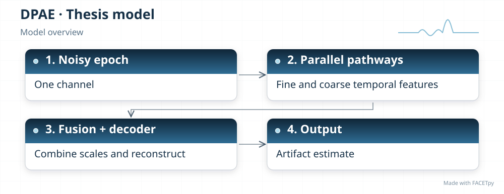
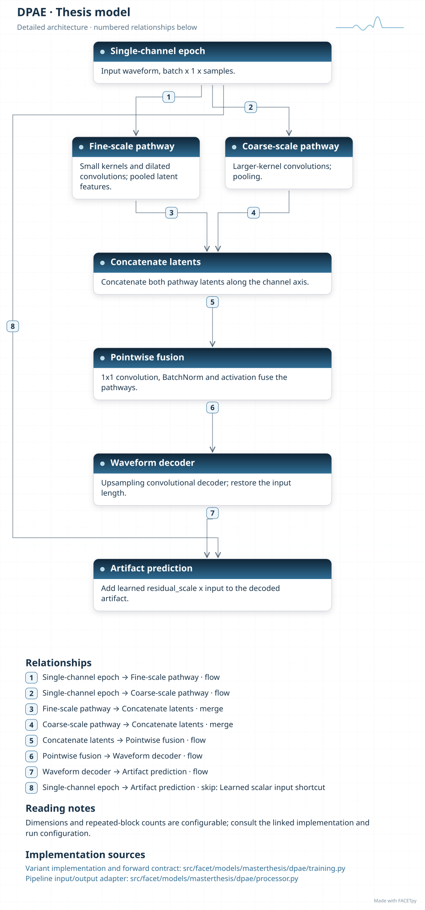
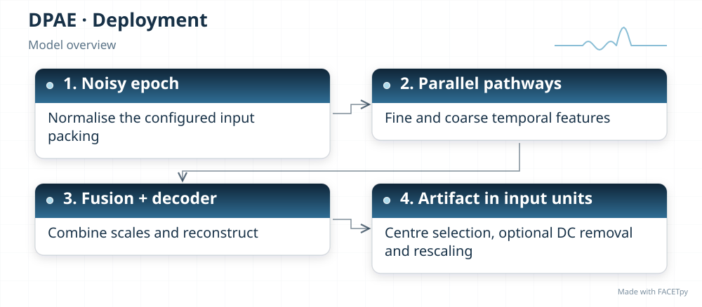
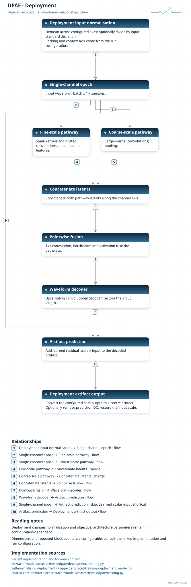
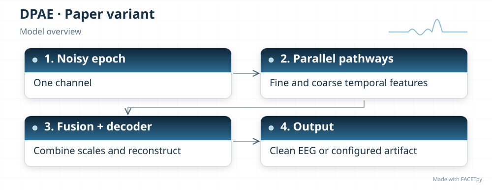
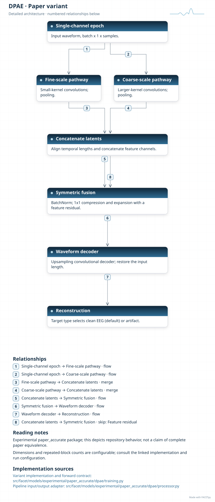

DPAE
====

DPAE reads a signal through two paths at different temporal scales. One path captures
fine detail; the other captures broader structure. A fusion module combines their
features before a decoder reconstructs the target.

Family and origin
-----------------

**Architecture:** Dual-pathway convolutional autoencoder.

**Origin:** EEG denoising.

Xiong, Ma and Li introduced a general dual-pathway autoencoder for EEG denoising
[Xiong2024]_. FACETpy uses a convolutional adaptation. The article appeared in January
2024; its DOI and volume carry 2023.

FACETpy adaptation
------------------

The base model estimates artifact from one channel and one epoch. The experimental
edition changes the fusion module, path strides and normalization, and predicts clean
EEG by default. These changes affect checkpoint compatibility and the meaning of the
output.

Implementation and input
------------------------

The main package is ``facet.models.masterthesis.dpae``. The recorded adapter contract is
**single epoch, one channel**. Input packing, demeaning and reconstruction are part of the
experiment; a family name alone does not identify them.

The base and deployment variants have separate factories. Select their input
packing, output type and normalization together with the checkpoint. A dataset
may store seven epochs even when a single-epoch adapter uses only the centre.

Experiments and evidence
------------------------

Use :doc:`../../masterthesis_guide/catalog` to select the phase, exact variant,
configuration and weights. :doc:`../selected_variants` explains how comparisons
differ. The family reference is not a claim of validated paper fidelity.

Variants and lineage
--------------------

The diagrams below describe each retained variant and its input/output contract.
Select the matching experiment and checkpoint through the catalog.

Source-paper record
-------------------

Sources: [Xiong2024]_. See :doc:`../model_references` for full references.

A source citation explains the design lineage. It does not establish that a
FACETpy checkpoint reproduces the source paper's training or results.

Architecture diagrams
---------------------

Each variant has a compact overview and an expandable detailed diagram. The
editable profiles link the implementation sources. Dimensions and repeated
blocks depend on the selected configuration.

.. model-diagrams-start

.. Generated by tools/diagrams/build_model_diagrams.py; edit model profiles and READMEs.

.. _diagram-masterthesis-dpae:

DPAE
~~~~

Variant: ``masterthesis/dpae``.

Dual-pathway convolutional autoencoder. Two convolutional pathways combine fine and coarse temporal features to predict a single-channel artifact.

   Compact overview; native print size is within half an A4 page.

.. raw:: html

   

   
Show detailed architecture

   Detailed data paths, branches and implementation sources.

.. raw:: html

   

:download:`Overview (SVG) <../../../../src/facet/models/masterthesis/dpae/diagrams/overview.svg>`
|
:download:`Detailed architecture (SVG) <../../../../src/facet/models/masterthesis/dpae/diagrams/architecture.svg>`
|
:download:`Editable profile (JSON) <../../../../src/facet/models/masterthesis/dpae/diagrams/architecture.json>`

.. raw:: html

   

   
Results: hyperparameters, training curves and evaluation

.. include:: ../../../../src/facet/models/masterthesis/dpae/diagrams/../results/index.rst

.. raw:: html

   

.. _diagram-masterthesis-dpae-deployment:

DPAE — deployment
~~~~~~~~~~~~~~~~~

Variant: ``masterthesis/dpae/deployment``.

Dual-pathway convolutional autoencoder. Two convolutional pathways combine fine and coarse temporal features to predict a single-channel artifact. The deployment wrapper normalizes input, restores output units and can remove the predicted epoch mean. Its objective scores recovered clean EEG.

   Compact overview; native print size is within half an A4 page.

.. raw:: html

   

   
Show detailed architecture

   Detailed data paths, branches and implementation sources.

.. raw:: html

   

:download:`Overview (SVG) <../../../../src/facet/models/masterthesis/dpae/deployment/diagrams/overview.svg>`
|
:download:`Detailed architecture (SVG) <../../../../src/facet/models/masterthesis/dpae/deployment/diagrams/architecture.svg>`
|
:download:`Editable profile (JSON) <../../../../src/facet/models/masterthesis/dpae/deployment/diagrams/architecture.json>`

.. raw:: html

   

   
Results: hyperparameters, training curves and evaluation

.. include:: ../../../../src/facet/models/masterthesis/dpae/deployment/diagrams/../results/index.rst

.. raw:: html

   

.. _diagram-experimental-paper-accurate-dpae:

DPAE — experimental paper_accurate
~~~~~~~~~~~~~~~~~~~~~~~~~~~~~~~~~~

Variant: ``experimental/paper_accurate/dpae``.

Dual-pathway convolutional autoencoder. This experimental variant adds a compression-and-expansion fusion module with a residual connection. It changes path strides and normalization, and predicts clean EEG by default.

   Compact overview; native print size is within half an A4 page.

.. raw:: html

   

   
Show detailed architecture

   Detailed data paths, branches and implementation sources.

.. raw:: html

   

:download:`Overview (SVG) <../../../../src/facet/models/experimental/paper_accurate/dpae/diagrams/overview.svg>`
|
:download:`Detailed architecture (SVG) <../../../../src/facet/models/experimental/paper_accurate/dpae/diagrams/architecture.svg>`
|
:download:`Editable profile (JSON) <../../../../src/facet/models/experimental/paper_accurate/dpae/diagrams/architecture.json>`

.. raw:: html

   

   
Results: hyperparameters, training curves and evaluation

.. include:: ../../../../src/facet/models/experimental/paper_accurate/dpae/diagrams/../results/index.rst

.. raw:: html

   

.. model-diagrams-end
