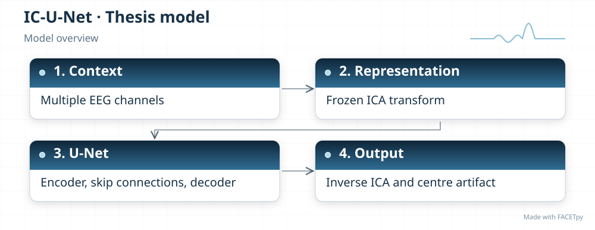
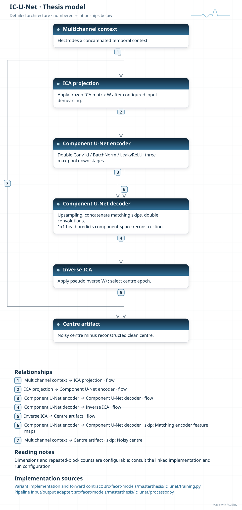
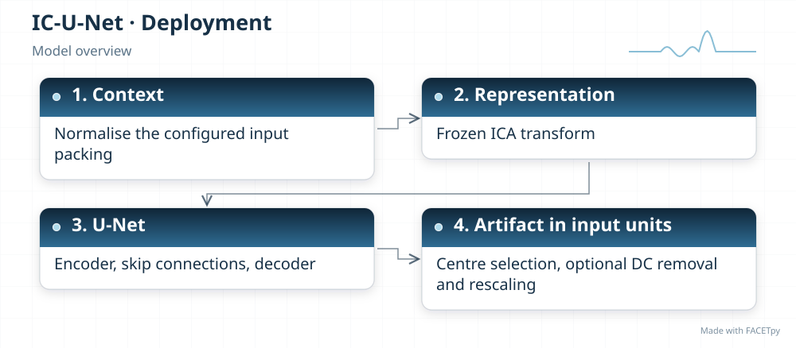
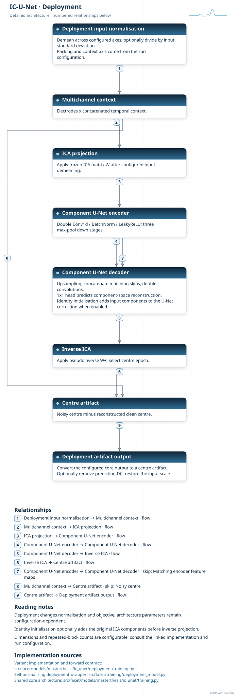
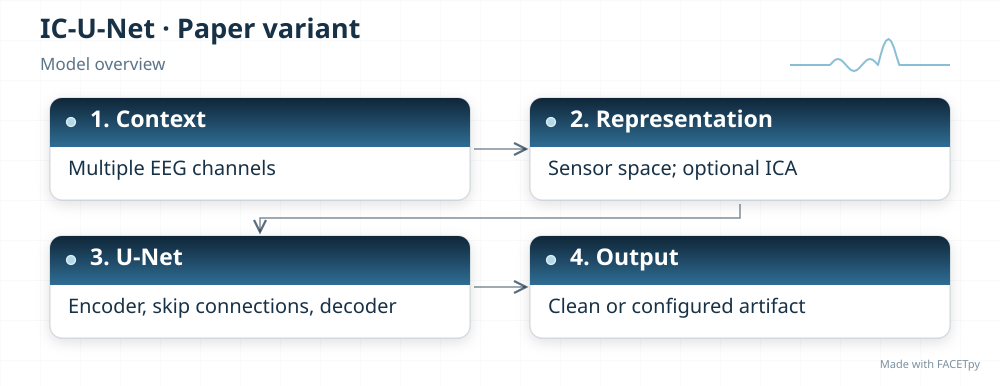
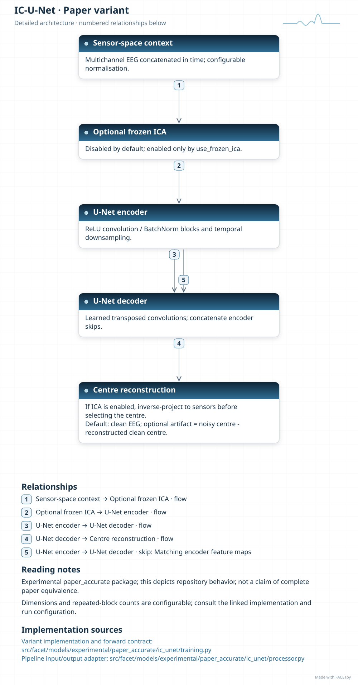

IC-U-Net
========

IC-U-Net uses an encoder-decoder with skip connections to reconstruct EEG. The encoder
compresses temporal features. The decoder combines those features with details retained
from earlier layers.

Family and origin
-----------------

**Architecture:** Multichannel U-Net denoising autoencoder.

**Origin:** EEG artifact removal using ICA-derived training pairs.

Chuang et al. trained IC-U-Net on mixtures of brain and non-brain independent components
[Chuang2022]_. Independent component analysis (ICA) supplies training pairs in the
original method; it is not a required transform inside the original inference network.

FACETpy adaptation
------------------

The thesis base model adds frozen ICA and inverse-ICA matrices around a multichannel
U-Net. It predicts artifact for the centre epoch. This is a FACETpy adaptation. The
experimental edition defaults to a sensor-space U-Net with clean-EEG output; frozen ICA
remains an option. The channel order must match the trained transform and checkpoint.

Implementation and input
------------------------

The main package is ``facet.models.masterthesis.ic_unet``. The recorded adapter contract is
**seven concatenated epochs, 30 channels in the recorded order**. Input packing, demeaning and reconstruction are part of the
experiment; a family name alone does not identify them.

The base and deployment variants have separate factories. Select their input
packing, output type and normalization together with the checkpoint. A dataset
may store seven epochs even when a single-epoch adapter uses only the centre.

Phase-2 pipeline output was flagged as invalid because of discontinuities.
Its recorded numerical residual must not be interpreted as successful correction.
The evidence and weights are retained so that the failure remains inspectable.

Experiments and evidence
------------------------

Use :doc:`../../masterthesis_guide/catalog` to select the phase, exact variant,
configuration and weights. :doc:`../selected_variants` explains how comparisons
differ. The family reference is not a claim of validated paper fidelity.

Variants and lineage
--------------------

The diagrams below describe each retained variant and its input/output contract.
Select the matching experiment and checkpoint through the catalog.

Source-paper record
-------------------

Sources: [Chuang2022]_. See :doc:`../model_references` for full references.

A source citation explains the design lineage. It does not establish that a
FACETpy checkpoint reproduces the source paper's training or results.

Architecture diagrams
---------------------

Each variant has a compact overview and an expandable detailed diagram. The
editable profiles link the implementation sources. Dimensions and repeated
blocks depend on the selected configuration.

.. model-diagrams-start

.. Generated by tools/diagrams/build_model_diagrams.py; edit model profiles and READMEs.

.. _diagram-masterthesis-ic-unet:

IC-U-Net
~~~~~~~~

Variant: ``masterthesis/ic_unet``.

Multichannel U-Net denoising autoencoder. A multichannel U-Net operates between frozen ICA and inverse-ICA transforms and predicts the centre-epoch artifact. The in-model ICA transforms are a FACETpy adaptation.

   Compact overview; native print size is within half an A4 page.

.. raw:: html

   

   
Show detailed architecture

   Detailed data paths, branches and implementation sources.

.. raw:: html

   

:download:`Overview (SVG) <../../../../src/facet/models/masterthesis/ic_unet/diagrams/overview.svg>`
|
:download:`Detailed architecture (SVG) <../../../../src/facet/models/masterthesis/ic_unet/diagrams/architecture.svg>`
|
:download:`Editable profile (JSON) <../../../../src/facet/models/masterthesis/ic_unet/diagrams/architecture.json>`

.. raw:: html

   

   
Results: hyperparameters, training curves and evaluation

.. include:: ../../../../src/facet/models/masterthesis/ic_unet/diagrams/../results/index.rst

.. raw:: html

   

.. _diagram-masterthesis-ic-unet-deployment:

IC-U-Net — deployment
~~~~~~~~~~~~~~~~~~~~~

Variant: ``masterthesis/ic_unet/deployment``.

Multichannel U-Net denoising autoencoder. A multichannel U-Net operates between frozen ICA and inverse-ICA transforms and predicts the centre-epoch artifact. The in-model ICA transforms are a FACETpy adaptation. The deployment wrapper normalizes input, restores output units and can remove the predicted epoch mean. Its objective scores recovered clean EEG.

   Compact overview; native print size is within half an A4 page.

.. raw:: html

   

   
Show detailed architecture

   Detailed data paths, branches and implementation sources.

.. raw:: html

   

:download:`Overview (SVG) <../../../../src/facet/models/masterthesis/ic_unet/deployment/diagrams/overview.svg>`
|
:download:`Detailed architecture (SVG) <../../../../src/facet/models/masterthesis/ic_unet/deployment/diagrams/architecture.svg>`
|
:download:`Editable profile (JSON) <../../../../src/facet/models/masterthesis/ic_unet/deployment/diagrams/architecture.json>`

.. raw:: html

   

   
Results: hyperparameters, training curves and evaluation

.. include:: ../../../../src/facet/models/masterthesis/ic_unet/deployment/diagrams/../results/index.rst

.. raw:: html

   

.. _diagram-experimental-paper-accurate-ic-unet:

IC-U-Net — experimental paper_accurate
~~~~~~~~~~~~~~~~~~~~~~~~~~~~~~~~~~~~~~

Variant: ``experimental/paper_accurate/ic_unet``.

Multichannel U-Net denoising autoencoder. This experimental variant defaults to a sensor-space U-Net with clean-EEG output and a learned upsampling decoder. Frozen ICA is optional rather than part of the default inference path.

   Compact overview; native print size is within half an A4 page.

.. raw:: html

   

   
Show detailed architecture

   Detailed data paths, branches and implementation sources.

.. raw:: html

   

:download:`Overview (SVG) <../../../../src/facet/models/experimental/paper_accurate/ic_unet/diagrams/overview.svg>`
|
:download:`Detailed architecture (SVG) <../../../../src/facet/models/experimental/paper_accurate/ic_unet/diagrams/architecture.svg>`
|
:download:`Editable profile (JSON) <../../../../src/facet/models/experimental/paper_accurate/ic_unet/diagrams/architecture.json>`

.. raw:: html

   

   
Results: hyperparameters, training curves and evaluation

.. include:: ../../../../src/facet/models/experimental/paper_accurate/ic_unet/diagrams/../results/index.rst

.. raw:: html

   

.. model-diagrams-end
