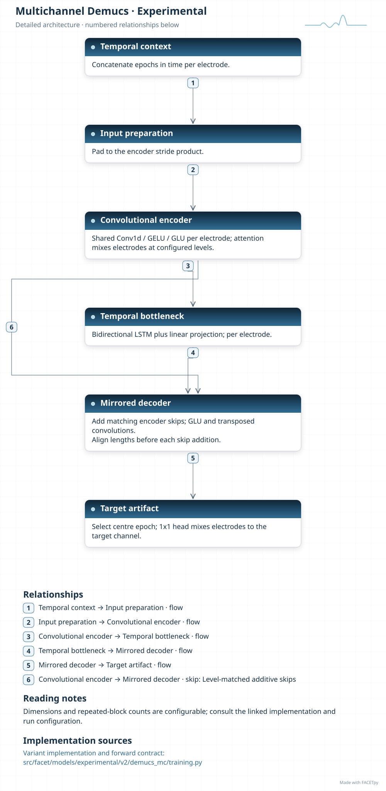

Multichannel Demucs extension
=============================

This Demucs extension reads a target electrode together with neighbouring electrodes. An
attention block exchanges information between electrodes. The temporal encoder,
recurrent bottleneck and decoder then estimate the artifact for the target channel.

Family and origin
-----------------

**Architecture:** Waveform encoder-decoder with electrode attention.

**Origin:** FACETpy extension of Demucs.

The parent architecture is :doc:`demucs`, derived from music source separation
[Defossez2019]_. Electrode selection and cross-electrode attention are FACETpy
additions. No separate paper is assigned to this extension.

FACETpy adaptation
------------------

The recorded diagnostic setup uses a target channel and two montage-selected neighbours.
It returns the centre artifact for the target channel. Its input and comparison scope
differ from the single-channel Demucs arm; results must remain separately identified.

Implementation and input
------------------------

The main package is ``facet.models.experimental.v2.demucs_mc``. The recorded adapter contract is
**three selected channels**. Input packing, demeaning and reconstruction are part of the
experiment; a family name alone does not identify them.

This diagnostic variant is kept in the experimental collection. It is not pooled
with the single-channel Phase-2 comparison. Its separate page preserves the
reference used by the thesis.

Experiments and evidence
------------------------

Use :doc:`../../masterthesis_guide/catalog` to select the phase, exact variant,
configuration and weights. :doc:`../selected_variants` explains how comparisons
differ. The family reference is not a claim of validated paper fidelity.

Variants and lineage
--------------------

The diagrams below describe each retained variant and its input/output contract.
Select the matching experiment and checkpoint through the catalog.

Source-paper record
-------------------

Sources: [Defossez2019]_. See :doc:`../model_references` for full references.

A source citation explains the design lineage. It does not establish that a
FACETpy checkpoint reproduces the source paper's training or results.

Architecture diagrams
---------------------

Each variant has a compact overview and an expandable detailed diagram. The
editable profiles link the implementation sources. Dimensions and repeated
blocks depend on the selected configuration.

.. model-diagrams-start

.. Generated by tools/diagrams/build_model_diagrams.py; edit model profiles and READMEs.

.. _diagram-experimental-v2-demucs-mc:

Multichannel Demucs
~~~~~~~~~~~~~~~~~~~

Variant: ``experimental/v2/demucs_mc``.

Waveform encoder-decoder with electrode attention. This experimental Demucs extension combines a target electrode and its neighbours through electrode attention, then predicts the target-channel centre artifact.

.. figure:: ../../../../src/facet/models/experimental/v2/demucs_mc/diagrams/overview.svg
   :width: 190mm
   :alt: Multichannel Demucs — compact model overview

   Compact overview; native print size is within half an A4 page.

.. raw:: html

   

   
Show detailed architecture

   Detailed data paths, branches and implementation sources.

.. raw:: html

   

:download:`Overview (SVG) <../../../../src/facet/models/experimental/v2/demucs_mc/diagrams/overview.svg>`
|
:download:`Detailed architecture (SVG) <../../../../src/facet/models/experimental/v2/demucs_mc/diagrams/architecture.svg>`
|
:download:`Editable profile (JSON) <../../../../src/facet/models/experimental/v2/demucs_mc/diagrams/architecture.json>`

.. raw:: html

   

   
Results: hyperparameters, training curves and evaluation

.. include:: ../../../../src/facet/models/experimental/v2/demucs_mc/diagrams/../results/index.rst

.. raw:: html

   

.. model-diagrams-end
