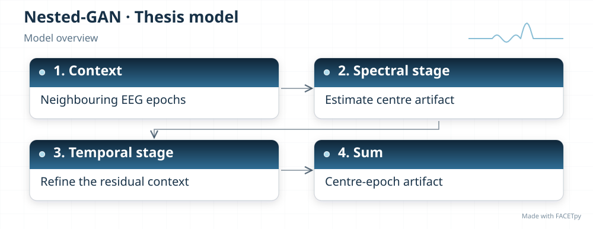
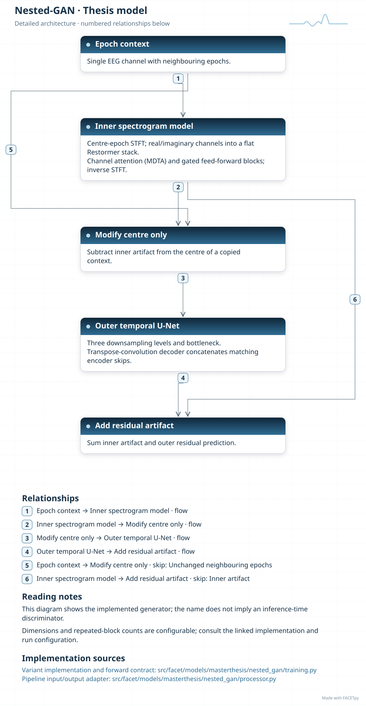
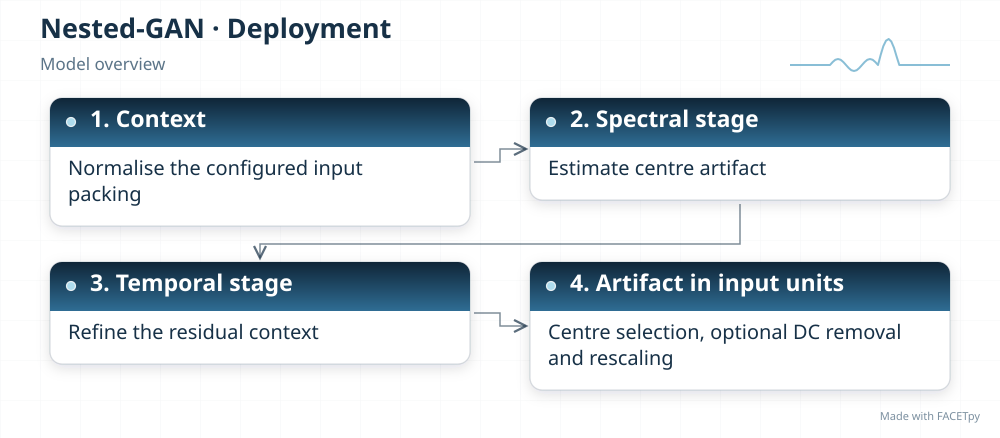
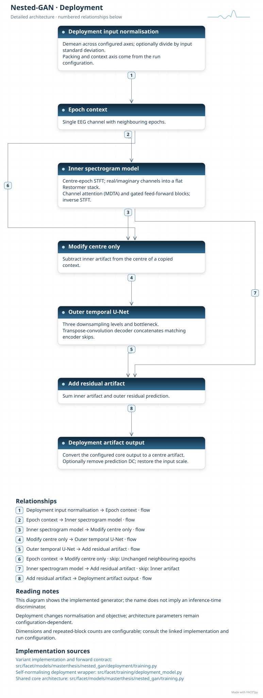
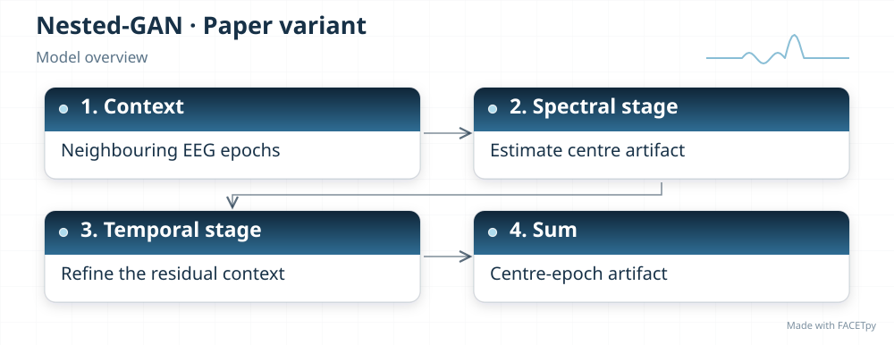
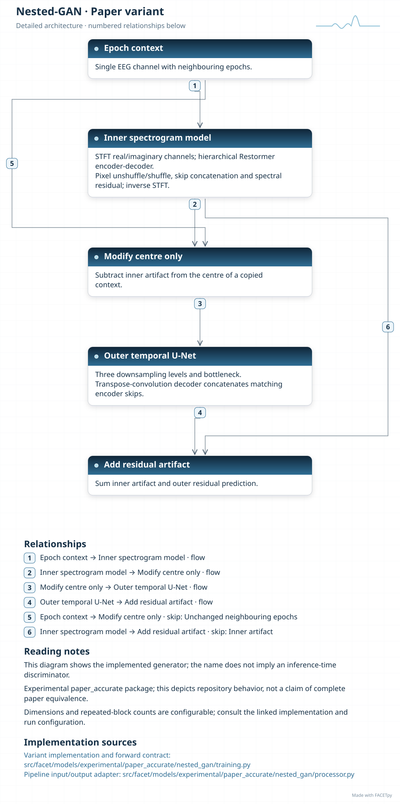

Nested GAN
==========

The FACETpy Nested-GAN adaptation first estimates an artifact in the time-frequency
domain. A temporal network then refines the residual signal. The model adds both
estimates to produce the centre-epoch artifact.

Family and origin
-----------------

**Architecture:** Spectral generator followed by temporal refinement.

**Origin:** EEG artifact removal; image-restoration building blocks.

Yang et al. describe an inner time-frequency GAN and an outer time-domain GAN for EEG
artifact removal [Yang2025]_. FACETpy also draws on Restormer, an image-restoration
Transformer [Zamir2022]_, for spectral processing.

FACETpy adaptation
------------------

The retained FACETpy training recipes are generator-only. They use reconstruction and
spectral losses rather than the source method's full nested adversarial training. The
experimental edition adds a multiscale Restormer-style spectral encoder-decoder. This
improves that component's structural alignment; it does not establish reproduction of
the complete Nested-GAN method.

Implementation and input
------------------------

The main package is ``facet.models.masterthesis.nested_gan``. The recorded adapter contract is
**seven epochs, one channel**. Input packing, demeaning and reconstruction are part of the
experiment; a family name alone does not identify them.

The base and deployment variants have separate factories. Select their input
packing, output type and normalization together with the checkpoint. A dataset
may store seven epochs even when a single-epoch adapter uses only the centre.

Experiments and evidence
------------------------

Use :doc:`../../masterthesis_guide/catalog` to select the phase, exact variant,
configuration and weights. :doc:`../selected_variants` explains how comparisons
differ. The family reference is not a claim of validated paper fidelity.

Variants and lineage
--------------------

The diagrams below describe each retained variant and its input/output contract.
Select the matching experiment and checkpoint through the catalog.

Source-paper record
-------------------

Sources: [Yang2025]_, [Zamir2022]_. See :doc:`../model_references` for full references.

A source citation explains the design lineage. It does not establish that a
FACETpy checkpoint reproduces the source paper's training or results.

Architecture diagrams
---------------------

Each variant has a compact overview and an expandable detailed diagram. The
editable profiles link the implementation sources. Dimensions and repeated
blocks depend on the selected configuration.

.. model-diagrams-start

.. Generated by tools/diagrams/build_model_diagrams.py; edit model profiles and READMEs.

.. _diagram-masterthesis-nested-gan:

Nested-GAN
~~~~~~~~~~

Variant: ``masterthesis/nested_gan``.

Spectral generator followed by temporal refinement. A spectral generator and temporal residual refiner predict the centre artifact from neighbouring epochs. This variant uses a generator-only recipe, without the paper's full nested adversarial training.

   Compact overview; native print size is within half an A4 page.

.. raw:: html

   

   
Show detailed architecture

   Detailed data paths, branches and implementation sources.

.. raw:: html

   

:download:`Overview (SVG) <../../../../src/facet/models/masterthesis/nested_gan/diagrams/overview.svg>`
|
:download:`Detailed architecture (SVG) <../../../../src/facet/models/masterthesis/nested_gan/diagrams/architecture.svg>`
|
:download:`Editable profile (JSON) <../../../../src/facet/models/masterthesis/nested_gan/diagrams/architecture.json>`

.. _diagram-masterthesis-nested-gan-deployment:

Nested-GAN — deployment
~~~~~~~~~~~~~~~~~~~~~~~

Variant: ``masterthesis/nested_gan/deployment``.

Spectral generator followed by temporal refinement. A spectral generator and temporal residual refiner predict the centre artifact from neighbouring epochs. This variant uses a generator-only recipe, without the paper's full nested adversarial training. The deployment wrapper normalizes input, restores output units and can remove the predicted epoch mean. Its objective scores recovered clean EEG.

   Compact overview; native print size is within half an A4 page.

.. raw:: html

   

   
Show detailed architecture

   Detailed data paths, branches and implementation sources.

.. raw:: html

   

:download:`Overview (SVG) <../../../../src/facet/models/masterthesis/nested_gan/deployment/diagrams/overview.svg>`
|
:download:`Detailed architecture (SVG) <../../../../src/facet/models/masterthesis/nested_gan/deployment/diagrams/architecture.svg>`
|
:download:`Editable profile (JSON) <../../../../src/facet/models/masterthesis/nested_gan/deployment/diagrams/architecture.json>`

.. _diagram-experimental-paper-accurate-nested-gan:

Nested-GAN — experimental paper_accurate
~~~~~~~~~~~~~~~~~~~~~~~~~~~~~~~~~~~~~~~~

Variant: ``experimental/paper_accurate/nested_gan``.

Spectral generator followed by temporal refinement. This experimental variant adds a hierarchical Restormer-style spectral generator. It keeps the temporal refiner and generator-only recipe; it is not a reproduction of the full nested GAN training method.

   Compact overview; native print size is within half an A4 page.

.. raw:: html

   

   
Show detailed architecture

   Detailed data paths, branches and implementation sources.

.. raw:: html

   

:download:`Overview (SVG) <../../../../src/facet/models/experimental/paper_accurate/nested_gan/diagrams/overview.svg>`
|
:download:`Detailed architecture (SVG) <../../../../src/facet/models/experimental/paper_accurate/nested_gan/diagrams/architecture.svg>`
|
:download:`Editable profile (JSON) <../../../../src/facet/models/experimental/paper_accurate/nested_gan/diagrams/architecture.json>`

.. model-diagrams-end
