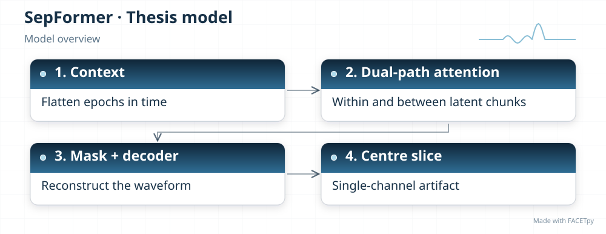
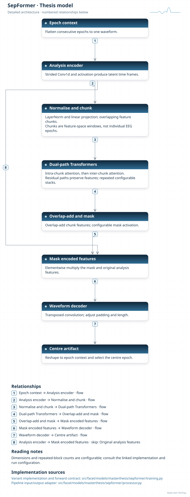
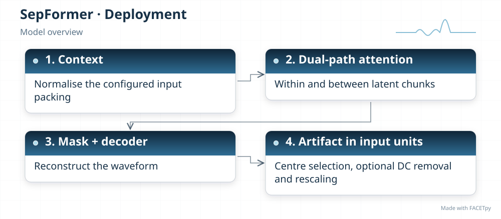
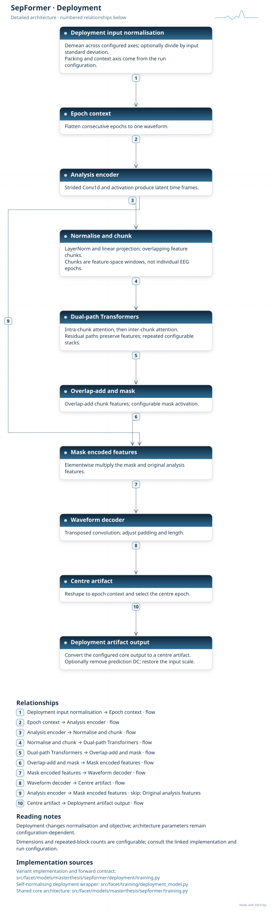
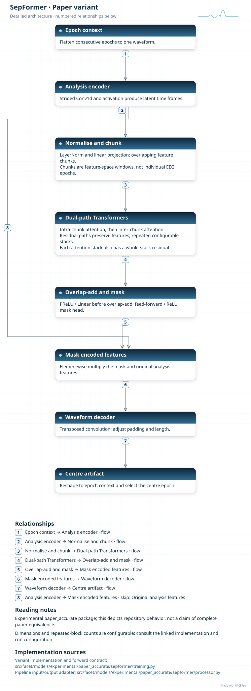

SepFormer
=========

SepFormer encodes a waveform and divides the learned features into overlapping chunks.
Attention first relates samples within each chunk, then relates chunks to one another. A
mask and decoder turn these features back into a waveform.

Family and origin
-----------------

**Architecture:** Dual-path attention source separator.

**Origin:** Speech separation.

Subakan et al. introduced SepFormer for speech separation [Subakan2021]_. FACETpy uses a
compact adaptation to estimate an EEG artifact.

FACETpy adaptation
------------------

The model receives concatenated epochs from one channel and returns the centre artifact.
Its attention chunks lie in learned feature space; they are not the seven input epochs.
Model capacity and loss are selected for the EEG experiment. A scale-invariant loss
alone does not constrain the absolute artifact amplitude needed for subtraction.

Implementation and input
------------------------

The main package is ``facet.models.masterthesis.sepformer``. The recorded adapter contract is
**seven epochs, one channel**. Input packing, demeaning and reconstruction are part of the
experiment; a family name alone does not identify them.

The base and deployment variants have separate factories. Select their input
packing, output type and normalization together with the checkpoint. A dataset
may store seven epochs even when a single-epoch adapter uses only the centre.

Experiments and evidence
------------------------

Use :doc:`../../masterthesis_guide/catalog` to select the phase, exact variant,
configuration and weights. :doc:`../selected_variants` explains how comparisons
differ. The family reference is not a claim of validated paper fidelity.

Variants and lineage
--------------------

The diagrams below describe each retained variant and its input/output contract.
Select the matching experiment and checkpoint through the catalog.

Source-paper record
-------------------

Sources: [Subakan2021]_. See :doc:`../model_references` for full references.

A source citation explains the design lineage. It does not establish that a
FACETpy checkpoint reproduces the source paper's training or results.

Architecture diagrams
---------------------

Each variant has a compact overview and an expandable detailed diagram. The
editable profiles link the implementation sources. Dimensions and repeated
blocks depend on the selected configuration.

.. model-diagrams-start

.. Generated by tools/diagrams/build_model_diagrams.py; edit model profiles and READMEs.

.. _diagram-masterthesis-sepformer:

SepFormer
~~~~~~~~~

Variant: ``masterthesis/sepformer``.

Dual-path attention source separator. Dual-path attention connects samples within and between learned feature chunks. A mask and decoder recover the centre-epoch artifact from one channel's context.

   Compact overview; native print size is within half an A4 page.

.. raw:: html

   

   
Show detailed architecture

   Detailed data paths, branches and implementation sources.

.. raw:: html

   

:download:`Overview (SVG) <../../../../src/facet/models/masterthesis/sepformer/diagrams/overview.svg>`
|
:download:`Detailed architecture (SVG) <../../../../src/facet/models/masterthesis/sepformer/diagrams/architecture.svg>`
|
:download:`Editable profile (JSON) <../../../../src/facet/models/masterthesis/sepformer/diagrams/architecture.json>`

.. raw:: html

   

   
Results: hyperparameters, training curves and evaluation

.. include:: ../../../../src/facet/models/masterthesis/sepformer/diagrams/../results/index.rst

.. raw:: html

   

.. _diagram-masterthesis-sepformer-deployment:

SepFormer — deployment
~~~~~~~~~~~~~~~~~~~~~~

Variant: ``masterthesis/sepformer/deployment``.

Dual-path attention source separator. Dual-path attention connects samples within and between learned feature chunks. A mask and decoder recover the centre-epoch artifact from one channel's context. The deployment wrapper normalizes input, restores output units and can remove the predicted epoch mean. Its objective scores recovered clean EEG.

   Compact overview; native print size is within half an A4 page.

.. raw:: html

   

   
Show detailed architecture

   Detailed data paths, branches and implementation sources.

.. raw:: html

   

:download:`Overview (SVG) <../../../../src/facet/models/masterthesis/sepformer/deployment/diagrams/overview.svg>`
|
:download:`Detailed architecture (SVG) <../../../../src/facet/models/masterthesis/sepformer/deployment/diagrams/architecture.svg>`
|
:download:`Editable profile (JSON) <../../../../src/facet/models/masterthesis/sepformer/deployment/diagrams/architecture.json>`

.. raw:: html

   

   
Results: hyperparameters, training curves and evaluation

.. include:: ../../../../src/facet/models/masterthesis/sepformer/deployment/diagrams/../results/index.rst

.. raw:: html

   

.. _diagram-experimental-paper-accurate-sepformer:

SepFormer — experimental paper_accurate
~~~~~~~~~~~~~~~~~~~~~~~~~~~~~~~~~~~~~~~

Variant: ``experimental/paper_accurate/sepformer``.

Dual-path attention source separator. This experimental variant revises the mask network and residual connections around the attention stacks. It keeps a compact, single-target EEG configuration rather than the original speech experiment.

   Compact overview; native print size is within half an A4 page.

.. raw:: html

   

   
Show detailed architecture

   Detailed data paths, branches and implementation sources.

.. raw:: html

   

:download:`Overview (SVG) <../../../../src/facet/models/experimental/paper_accurate/sepformer/diagrams/overview.svg>`
|
:download:`Detailed architecture (SVG) <../../../../src/facet/models/experimental/paper_accurate/sepformer/diagrams/architecture.svg>`
|
:download:`Editable profile (JSON) <../../../../src/facet/models/experimental/paper_accurate/sepformer/diagrams/architecture.json>`

.. raw:: html

   

   
Results: hyperparameters, training curves and evaluation

.. include:: ../../../../src/facet/models/experimental/paper_accurate/sepformer/diagrams/../results/index.rst

.. raw:: html

   

.. model-diagrams-end
