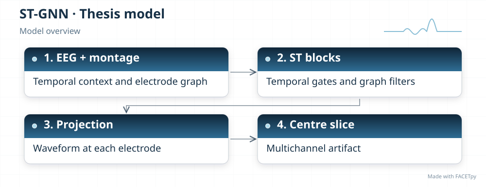
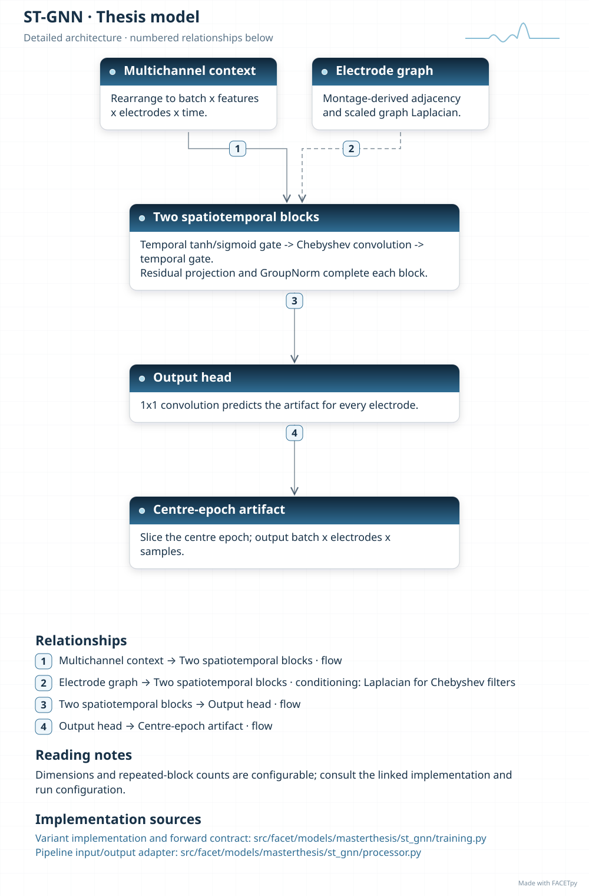
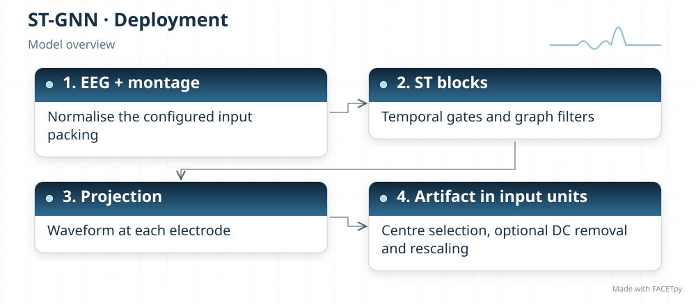
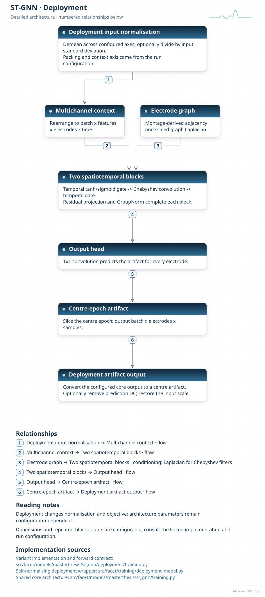
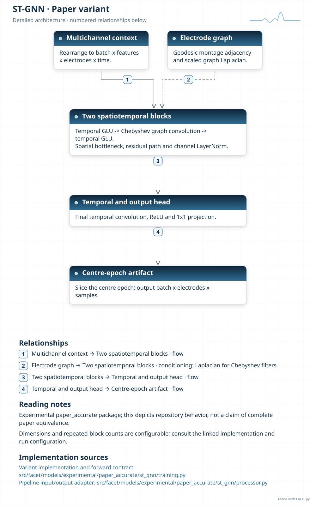

ST-GNN
======

ST-GNN treats electrodes as nodes in a graph. Temporal convolutions describe changes
within each electrode signal. Graph filters combine those features across connected
electrodes. The output is an artifact waveform for each channel.

Family and origin
-----------------

**Architecture:** Spatiotemporal graph convolution network.

**Origin:** Traffic forecasting and EEG graph modelling.

The temporal-graph blocks draw on STGCN, introduced for traffic forecasting [Yu2018]_.
Chebyshev graph filters follow Defferrard et al. [Defferrard2016]_. The experimental
electrode graph also draws on EEG-GCNN [Wagh2020]_, a classification method. FACETpy
combines these ideas for waveform regression.

FACETpy adaptation
------------------

The thesis model uses a fixed graph and recorded channel order. The experimental edition
changes temporal gates, graph-block normalization and the distance used to construct the
electrode graph. It preserves waveform length and uses spatial adjacency without the
EEG-GCNN functional-coherence branch. Neither variant is the original traffic forecaster
or EEG classifier.

Implementation and input
------------------------

The main package is ``facet.models.masterthesis.st_gnn``. The recorded adapter contract is
**seven epochs, 30 channels in the recorded order**. Input packing, demeaning and reconstruction are part of the
experiment; a family name alone does not identify them.

The base and deployment variants have separate factories. Select their input
packing, output type and normalization together with the checkpoint. A dataset
may store seven epochs even when a single-epoch adapter uses only the centre.

Phase-2 pipeline output was flagged as invalid because of discontinuities.
Its recorded numerical residual must not be interpreted as successful correction.
The evidence and weights are retained so that the failure remains inspectable.

Experiments and evidence
------------------------

Use :doc:`../../masterthesis_guide/catalog` to select the phase, exact variant,
configuration and weights. :doc:`../selected_variants` explains how comparisons
differ. The family reference is not a claim of validated paper fidelity.

Variants and lineage
--------------------

The diagrams below describe each retained variant and its input/output contract.
Select the matching experiment and checkpoint through the catalog.

Source-paper record
-------------------

Sources: [Yu2018]_, [Defferrard2016]_, [Wagh2020]_. See :doc:`../model_references` for full references.

A source citation explains the design lineage. It does not establish that a
FACETpy checkpoint reproduces the source paper's training or results.

Architecture diagrams
---------------------

Each variant has a compact overview and an expandable detailed diagram. The
editable profiles link the implementation sources. Dimensions and repeated
blocks depend on the selected configuration.

.. model-diagrams-start

.. Generated by tools/diagrams/build_model_diagrams.py; edit model profiles and READMEs.

.. _diagram-masterthesis-st-gnn:

ST-GNN
~~~~~~

Variant: ``masterthesis/st_gnn``.

Spatiotemporal graph convolution network. Temporal convolutions and graph filters predict multichannel artifacts on a fixed electrode graph. Channel order and montage belong to the trained model contract.

   Compact overview; native print size is within half an A4 page.

.. raw:: html

   

   
Show detailed architecture

   Detailed data paths, branches and implementation sources.

.. raw:: html

   

:download:`Overview (SVG) <../../../../src/facet/models/masterthesis/st_gnn/diagrams/overview.svg>`
|
:download:`Detailed architecture (SVG) <../../../../src/facet/models/masterthesis/st_gnn/diagrams/architecture.svg>`
|
:download:`Editable profile (JSON) <../../../../src/facet/models/masterthesis/st_gnn/diagrams/architecture.json>`

.. raw:: html

   

   
Results: hyperparameters, training curves and evaluation

.. include:: ../../../../src/facet/models/masterthesis/st_gnn/diagrams/../results/index.rst

.. raw:: html

   

.. _diagram-masterthesis-st-gnn-deployment:

ST-GNN — deployment
~~~~~~~~~~~~~~~~~~~

Variant: ``masterthesis/st_gnn/deployment``.

Spatiotemporal graph convolution network. Temporal convolutions and graph filters predict multichannel artifacts on a fixed electrode graph. Channel order and montage belong to the trained model contract. The deployment wrapper normalizes input, restores output units and can remove the predicted epoch mean. Its objective scores recovered clean EEG.

   Compact overview; native print size is within half an A4 page.

.. raw:: html

   

   
Show detailed architecture

   Detailed data paths, branches and implementation sources.

.. raw:: html

   

:download:`Overview (SVG) <../../../../src/facet/models/masterthesis/st_gnn/deployment/diagrams/overview.svg>`
|
:download:`Detailed architecture (SVG) <../../../../src/facet/models/masterthesis/st_gnn/deployment/diagrams/architecture.svg>`
|
:download:`Editable profile (JSON) <../../../../src/facet/models/masterthesis/st_gnn/deployment/diagrams/architecture.json>`

.. raw:: html

   

   
Results: hyperparameters, training curves and evaluation

.. include:: ../../../../src/facet/models/masterthesis/st_gnn/deployment/diagrams/../results/index.rst

.. raw:: html

   

.. _diagram-experimental-paper-accurate-st-gnn:

ST-GNN — experimental paper_accurate
~~~~~~~~~~~~~~~~~~~~~~~~~~~~~~~~~~~~

Variant: ``experimental/paper_accurate/st_gnn``.

Spatiotemporal graph convolution network. This experimental variant uses linear-sigmoid temporal gates, a graph bottleneck, layer normalization and spherical electrode distances. It reconstructs EEG waveforms rather than forecasting traffic or classifying recordings.

   Compact overview; native print size is within half an A4 page.

.. raw:: html

   

   
Show detailed architecture

   Detailed data paths, branches and implementation sources.

.. raw:: html

   

:download:`Overview (SVG) <../../../../src/facet/models/experimental/paper_accurate/st_gnn/diagrams/overview.svg>`
|
:download:`Detailed architecture (SVG) <../../../../src/facet/models/experimental/paper_accurate/st_gnn/diagrams/architecture.svg>`
|
:download:`Editable profile (JSON) <../../../../src/facet/models/experimental/paper_accurate/st_gnn/diagrams/architecture.json>`

.. raw:: html

   

   
Results: hyperparameters, training curves and evaluation

.. include:: ../../../../src/facet/models/experimental/paper_accurate/st_gnn/diagrams/../results/index.rst

.. raw:: html

   

.. model-diagrams-end
