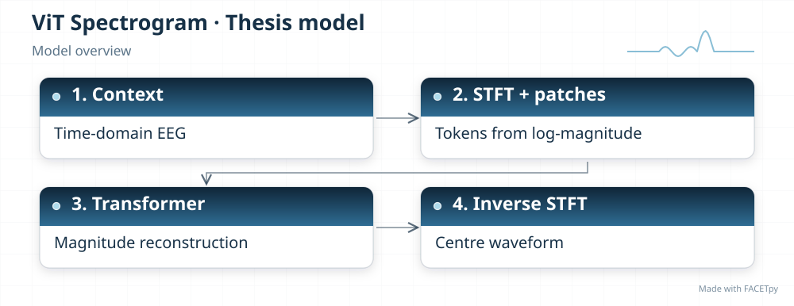
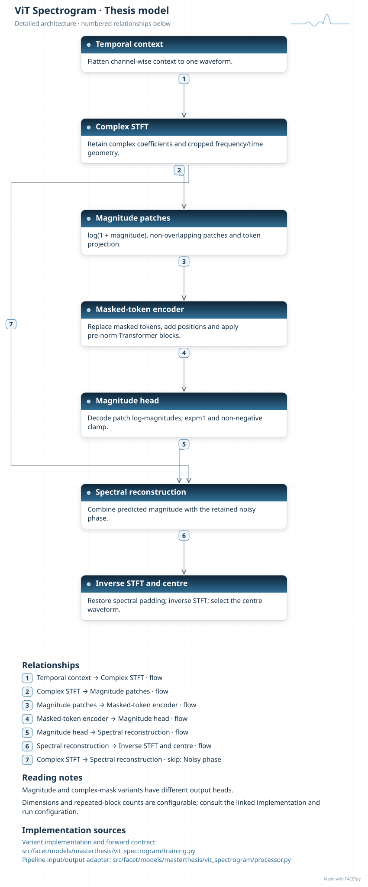
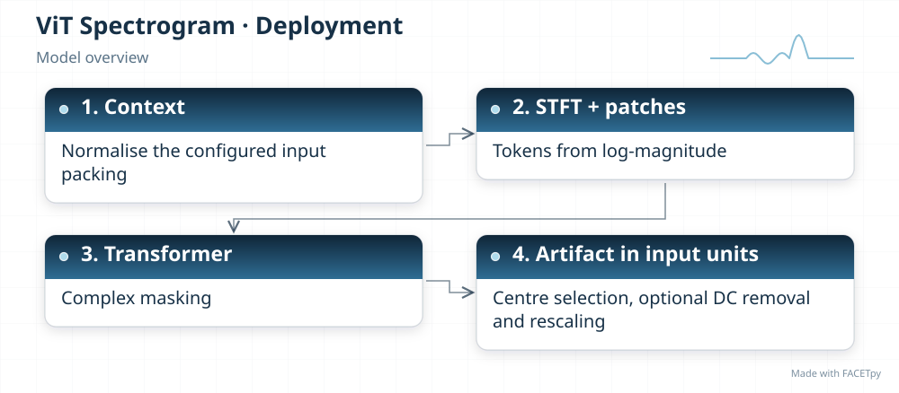
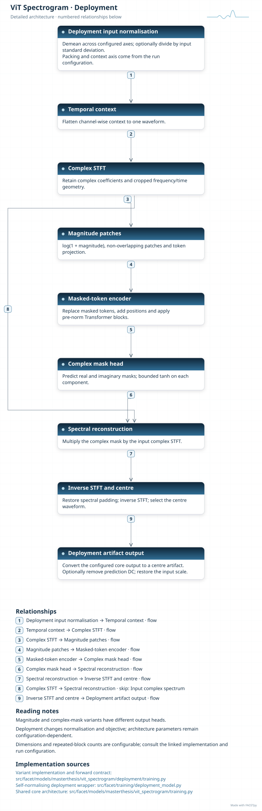
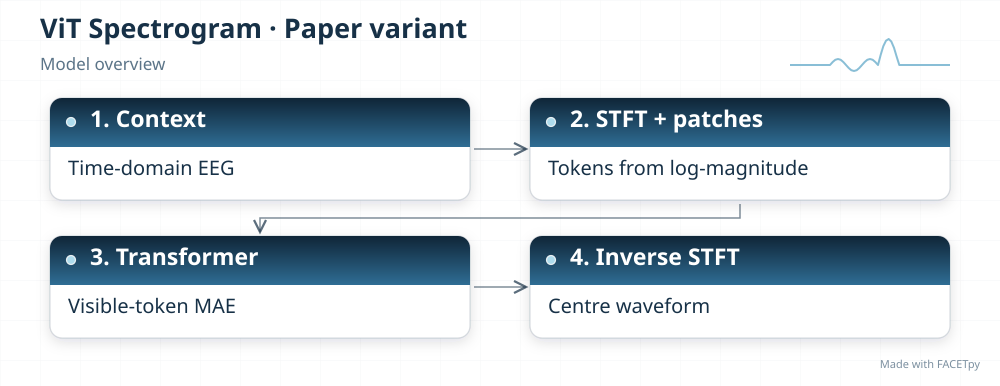
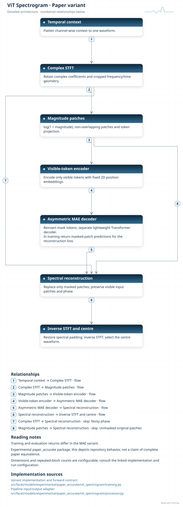

ViT-Spectrogram
===============

This model converts EEG into a time-frequency representation with the short-time Fourier
transform (STFT). It splits the spectrogram into patches and uses attention to predict
the centre region from context. An inverse STFT reconstructs the waveform.

Family and origin
-----------------

**Architecture:** Spectrogram Transformer with masked reconstruction.

**Origin:** Image recognition and masked image reconstruction.

The patch encoder draws on Vision Transformer (ViT) [Dosovitskiy2021]_. Masked
autoencoding (MAE) supplies the reconstruction idea [He2022]_. The EEG spectrogram,
centre-epoch mask and correction target are FACETpy adaptations.

FACETpy adaptation
------------------

The base model predicts clean magnitude and reuses the noisy phase. Its adapter derives
artifact by subtracting the clean prediction from the noisy centre epoch. The deployment
variant instead learns a complex mask, so it can change both magnitude and phase. The
experimental MAE edition encodes only visible patches and uses a separate decoder; it
retains magnitude-based waveform reconstruction.

Implementation and input
------------------------

The main package is ``facet.models.masterthesis.vit_spectrogram``. The recorded adapter contract is
**seven epochs, one channel**. Input packing, demeaning and reconstruction are part of the
experiment; a family name alone does not identify them.

The base and deployment variants have separate factories. Select their input
packing, output type and normalization together with the checkpoint. A dataset
may store seven epochs even when a single-epoch adapter uses only the centre.

The Phase-1 model predicts clean EEG. Its adapter subtracts this prediction
from the demeaned noisy centre epoch to obtain the artifact. The deployment
variant returns an artifact estimate through its own reconstruction wrapper.

Experiments and evidence
------------------------

Use :doc:`../../masterthesis_guide/catalog` to select the phase, exact variant,
configuration and weights. :doc:`../selected_variants` explains how comparisons
differ. The family reference is not a claim of validated paper fidelity.

Variants and lineage
--------------------

The diagrams below describe each retained variant and its input/output contract.
Select the matching experiment and checkpoint through the catalog.

Source-paper record
-------------------

Sources: [Dosovitskiy2021]_, [He2022]_. See :doc:`../model_references` for full references.

A source citation explains the design lineage. It does not establish that a
FACETpy checkpoint reproduces the source paper's training or results.

Architecture diagrams
---------------------

Each variant has a compact overview and an expandable detailed diagram. The
editable profiles link the implementation sources. Dimensions and repeated
blocks depend on the selected configuration.

.. model-diagrams-start

.. Generated by tools/diagrams/build_model_diagrams.py; edit model profiles and READMEs.

.. _diagram-masterthesis-vit-spectrogram:

ViT Spectrogram
~~~~~~~~~~~~~~~

Variant: ``masterthesis/vit_spectrogram``.

Spectrogram Transformer with masked reconstruction. A patch Transformer reconstructs clean spectrogram magnitude and combines it with noisy phase. The adapter derives the centre artifact from the reconstructed clean waveform.

   Compact overview; native print size is within half an A4 page.

.. raw:: html

   

   
Show detailed architecture

   Detailed data paths, branches and implementation sources.

.. raw:: html

   

:download:`Overview (SVG) <../../../../src/facet/models/masterthesis/vit_spectrogram/diagrams/overview.svg>`
|
:download:`Detailed architecture (SVG) <../../../../src/facet/models/masterthesis/vit_spectrogram/diagrams/architecture.svg>`
|
:download:`Editable profile (JSON) <../../../../src/facet/models/masterthesis/vit_spectrogram/diagrams/architecture.json>`

.. _diagram-masterthesis-vit-spectrogram-deployment:

ViT Spectrogram — deployment
~~~~~~~~~~~~~~~~~~~~~~~~~~~~

Variant: ``masterthesis/vit_spectrogram/deployment``.

Spectrogram Transformer with masked reconstruction. This deployment variant replaces magnitude-only prediction with a complex spectrogram mask. It can change phase and magnitude, reconstructs a waveform, and returns the centre artifact in input units. It trains against recovered clean EEG.

   Compact overview; native print size is within half an A4 page.

.. raw:: html

   

   
Show detailed architecture

   Detailed data paths, branches and implementation sources.

.. raw:: html

   

:download:`Overview (SVG) <../../../../src/facet/models/masterthesis/vit_spectrogram/deployment/diagrams/overview.svg>`
|
:download:`Detailed architecture (SVG) <../../../../src/facet/models/masterthesis/vit_spectrogram/deployment/diagrams/architecture.svg>`
|
:download:`Editable profile (JSON) <../../../../src/facet/models/masterthesis/vit_spectrogram/deployment/diagrams/architecture.json>`

.. _diagram-experimental-paper-accurate-vit-spectrogram:

ViT Spectrogram — experimental paper_accurate
~~~~~~~~~~~~~~~~~~~~~~~~~~~~~~~~~~~~~~~~~~~~~

Variant: ``experimental/paper_accurate/vit_spectrogram``.

Spectrogram Transformer with masked reconstruction. This experimental variant encodes visible patches and reconstructs masked patches with a separate MAE decoder. It retains magnitude prediction and noisy phase for waveform reconstruction.

   Compact overview; native print size is within half an A4 page.

.. raw:: html

   

   
Show detailed architecture

   Detailed data paths, branches and implementation sources.

.. raw:: html

   

:download:`Overview (SVG) <../../../../src/facet/models/experimental/paper_accurate/vit_spectrogram/diagrams/overview.svg>`
|
:download:`Detailed architecture (SVG) <../../../../src/facet/models/experimental/paper_accurate/vit_spectrogram/diagrams/architecture.svg>`
|
:download:`Editable profile (JSON) <../../../../src/facet/models/experimental/paper_accurate/vit_spectrogram/diagrams/architecture.json>`

.. model-diagrams-end
