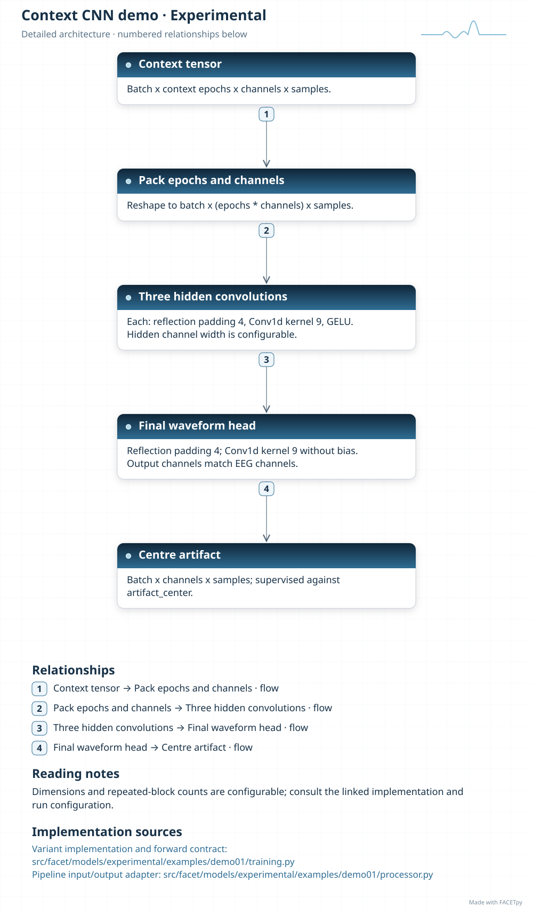

Deep learning
=============

FACETpy separates model training from correction of a recording. A training
configuration selects a dataset factory, model factory, objective and optimizer.
A trained model or exported artifact then enters the normal processor pipeline
through ``DeepLearningCorrection``.

Choosing a model
----------------

Start with the :doc:`family and variant overview <../thesis_reference/selected_variants>`.
The :doc:`family pages <../thesis_reference/models/index>` explain each model's
origin, input, output and FACETpy adaptations. The diagrams on each model page show the implemented signal paths.

Installed-library inference
---------------------------

Install ``facetpy[pytorch]`` for the thesis PyTorch models. The ``tensorflow``
extra supports the separate TensorFlow backend. Installing the library does not
install weights or research datasets.

Supply an artifact explicitly. For example, a Demucs deployment export can be
used as follows:

.. code-block:: python

   from facet.correction import DeepLearningCorrection
   from facet.models.masterthesis.adapters import FamilyAdapter
   from facet.models.masterthesis.pipeline import build

   model = FamilyAdapter(
       "demucs_deployment",
       checkpoint="/data/models/demucs_deployment_cpu.ts",
       device="cpu",
   )
   result = build(
       "/data/NiazyFMRI.edf",
       correctors=[DeepLearningCorrection(model=model)],
   ).run()
   if not result.success:
       raise RuntimeError(result.error)
   result.get_raw().save("/data/results/corrected_raw.fif", overwrite=False)

This example uses the recorded thesis preprocessing chain. Other applications
can compose their own :doc:`pipelines`. The adapter accepts volts, preserves the
recorded channel order and reconstructs artifact estimates at the recording's
epoch boundaries. Multichannel models require the recorded montage.

TorchScript exports contain the executable graph. A state-dictionary checkpoint
also needs its exact model factory and keyword arguments. ``FamilyAdapter``
accepts ``model_factory`` and ``model_kwargs`` for this purpose and loads weights
strictly. A Git LFS pointer is rejected before model loading.

Training
--------

Use the installed ``facet-train`` command:

.. code-block:: console

   facet-train fit --config /data/configs/experiment.yaml

The configuration supplies ``data``, ``model`` and ``training`` sections.
Factory strings use ``python.module:callable``. A run records its resolved
configuration, training history, checkpoints and exports. For historical runs,
the final export and the best validation checkpoint can differ; select the
artifact recorded for the result being reproduced.

The thesis repository adds an experiment resolver and saved evidence. It is a
checkout workflow, not an installed-package dependency. See
:doc:`../masterthesis_guide/quickstart` and
:doc:`../thesis_reference/selected_variants` for the exact data, input packing
and checkpoint associations.

Context CNN teaching example
----------------------------

``facet.models.experimental.examples.demo01`` contains a small convolutional
neural network (CNN) for synthetic spike-artifact examples. It combines the
epoch and channel axes as input features. Three convolution blocks process the
context; a final convolution predicts the centre artifact for each channel.

This model was developed within FACETpy and has no assigned source paper. It
illustrates the dataset, factory and correction interfaces. It is separate from
the fully connected Context DAE used in the thesis. See
:ref:`diagram-experimental-examples-demo01` for its two diagrams and source files.

.. model-diagrams-start

.. Generated by tools/diagrams/build_model_diagrams.py; edit model profiles and READMEs.

.. _diagram-experimental-examples-demo01:

Context CNN demo
~~~~~~~~~~~~~~~~

Variant: ``experimental/examples/demo01``.

A small context convolution network for synthetic spike-artifact examples. It stacks epochs as features and predicts the centre artifact. It is a teaching example, separate from the fully connected Context DAE and the thesis result models.

.. figure:: ../../../src/facet/models/experimental/examples/demo01/diagrams/overview.svg
   :width: 190mm
   :alt: Context CNN demo — compact model overview

   Compact overview; native print size is within half an A4 page.

.. raw:: html

   

   
Show detailed architecture

   Detailed data paths, branches and implementation sources.

.. raw:: html

   

:download:`Overview (SVG) <../../../src/facet/models/experimental/examples/demo01/diagrams/overview.svg>`
|
:download:`Detailed architecture (SVG) <../../../src/facet/models/experimental/examples/demo01/diagrams/architecture.svg>`
|
:download:`Editable profile (JSON) <../../../src/facet/models/experimental/examples/demo01/diagrams/architecture.json>`

.. model-diagrams-end

Verification scope
------------------

Synthetic tests check shape, units and correction behavior. They do not establish
scientific performance. A numerical replay needs the original recording or
dataset, saved split, preprocessing, artifact and metric protocol. A low residual
artifact score is insufficient when the output has discontinuities or suppresses
physiological activity.
